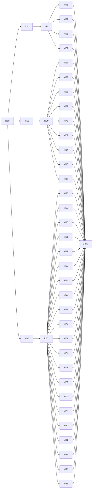
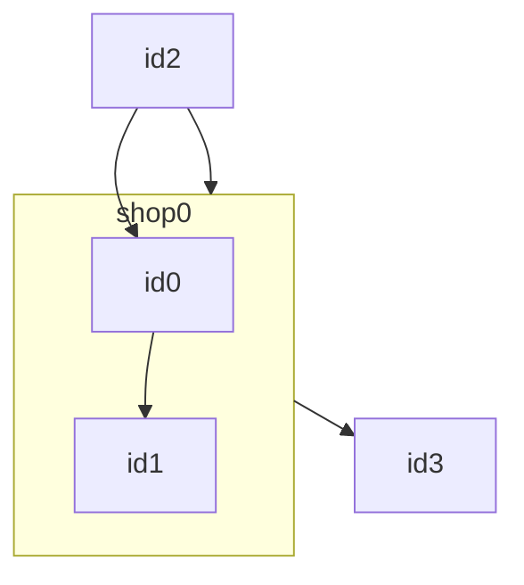

```mermaid
flowchart LR

id88 --> id0
id0 --> id1
id88 --> id18
id18 --> id19
id88 --> id36
id36 --> id37
id19 --> id54
id54 --> id89
id37 --> id55
id55 --> id89
id1 --> id56
id56 --> id89
id1 --> id57
id57 --> id89
id37 --> id58
id58 --> id89
id19 --> id59
id59 --> id89
id37 --> id60
id60 --> id89
id37 --> id61
id61 --> id89
id37 --> id62
id62 --> id89
id37 --> id63
id63 --> id89
id37 --> id64
id64 --> id89
id1 --> id65
id65 --> id89
id19 --> id66
id66 --> id89
id19 --> id67
id67 --> id89
id37 --> id68
id68 --> id89
id37 --> id69
id69 --> id89
id37 --> id70
id70 --> id89
id37 --> id71
id71 --> id89
id37 --> id72
id72 --> id89
id37 --> id73
id73 --> id89
id37 --> id74
id74 --> id89
id19 --> id75
id75 --> id89
id37 --> id76
id76 --> id89
id1 --> id77
id77 --> id89
id37 --> id78
id78 --> id89
id19 --> id79
id79 --> id89
id37 --> id80
id80 --> id89
id37 --> id81
id81 --> id89
id37 --> id82
id82 --> id89
id37 --> id83
id83 --> id89
id19 --> id84
id84 --> id89
id19 --> id85
id85 --> id89
id37 --> id86
id86 --> id89
id19 --> id87
id87 --> id89
```

```mermaid
flowchart TD

id2 --> shop0 & id0

subgraph shop0
id0 --> id1
end

shop0 --> id3
```
