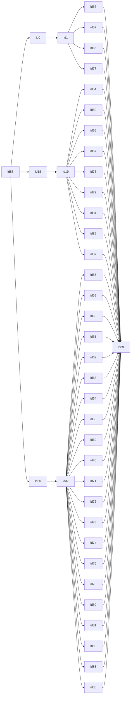
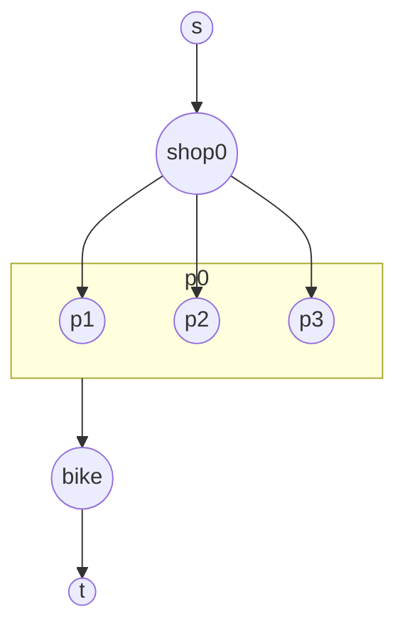
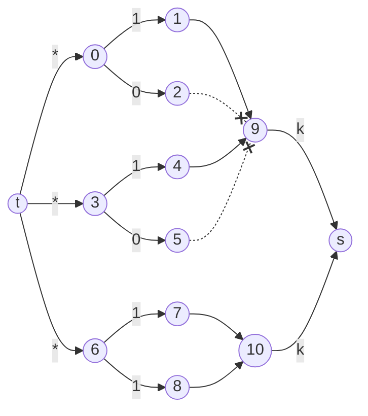

```java
public static void testCase() {
	int n = In.readInt();   // bikes
	int m = In.readInt();   // shops
	int k = In.readInt();   // parts
	int s = m*(k+1)+n;      // source
	int t = s+1;            // target
	
	Graph G = new Graph(m*(k+1)+n+2);
	
	// source -> shops -> parts
	for (int i = 0; i < m; i++) {
		int shop = i*(k+1);   // i-th shop
		G.addEdge(s, shop, Integer.MAX_VALUE);
		for (int p = 1; p <= k; p++) {
			int stock = In.readInt();
			G.addEdge(shop, shop+p, stock);
		}
	}
	
	// local shop's parts -> bikes -> target
	for (int i = 0; i < n; i++) {
		int bike = m*(k+1)+i;     // i-th bike
		int d = In.readInt();     // how many local shops
		for (int j = 0; j < d; j++) {
			int local = In.readInt()*(k+1);
			// p-th product from j-th local shop
			for (int p = 1; p <= k; p++) {
				G.addEdge(local+p, bike, 1);
			}
		}
		G.addEdge(bike, t, k);
	}
	
	boolean possible = G.computeMaximumFlow(s, t) == n*k;
	Out.println(possible? "yes" : "no");
}
```

works, but this thing breaks it..








i have no idea what to do


i have an idea of what to do



