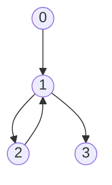
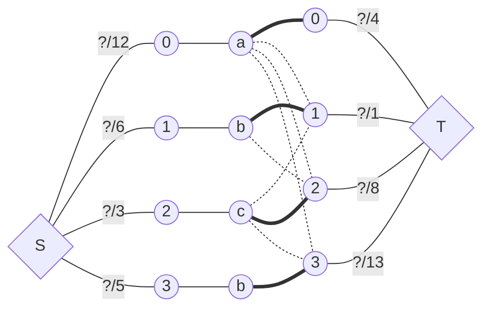
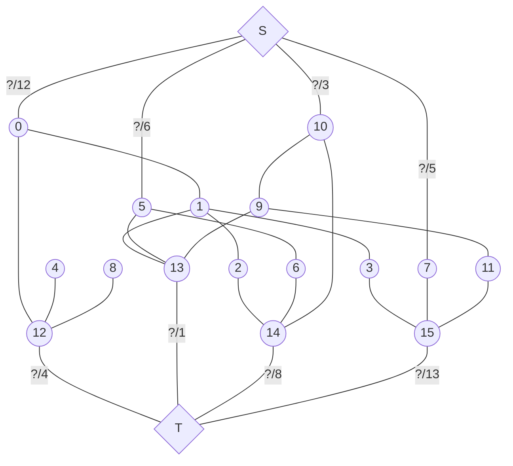
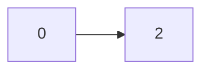
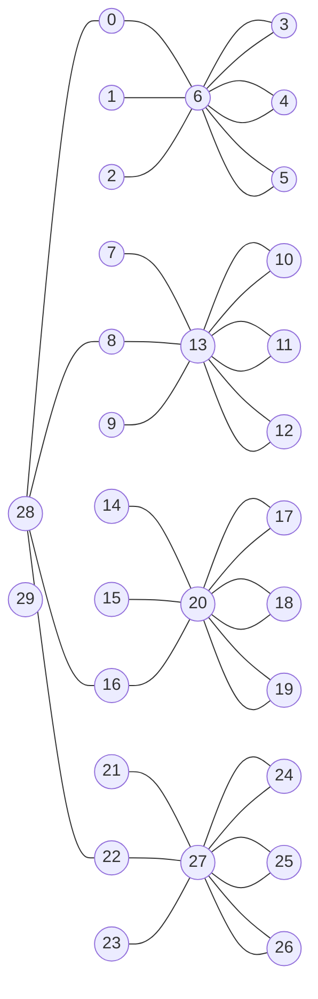

## Stats

```
n	=	4
m	=	4
v	= 	[1, 2, 3, 2]	
p	=	[12, 6, 3, 5]
d	=	[4, 1, 8, 13]

0 --> 1
1 --> 2
2 --> 1
1 --> 3
```

## Graph



## Network



doesn't work!

## Alternate



![[cx12-great-harvest-graph.png]]


## Code

```java
public static void testCase() {
	int n = In.readInt();   // cities
	int m = In.readInt();   // roads
	int s = 4*n;
	int t = s+1;
	int I = Integer.MAX_VALUE;
	
	int[] variety = new int[n];
	int demands = 0;
	int produce = 0;
	
	Graph G = new Graph(4*n+2);
	
	for (int i = 1; i <= n; i++) {
		int v = In.readInt();
		int p = In.readInt();
		int d = In.readInt();
		variety[i-1] = v;
		demands += d;
		produce += p;
		
		int a = 4*(i-1);
		int b = a+4;
		G.addEdge(s, a+v, p);
		G.addEdge(b, t, d);
		
		for (int j = 1; j <= 3; j++) {
			G.addEdge(a+j, b, I);
		}
	}
	
	for (int i = 1; i <= m; i++) {
		int a = In.readInt();
		int b = In.readInt();
		
		for (int j = 1; j <= 3; j++) {
			if (variety[b] != j) {
				G.addEdge(4*a+j, 4*b+j, I);
			}
		}
	} 
	
	boolean possible = G.computeMaximumFlow(s, t) == demandsy;
	Out.println(possible? "y" : "n");
}
```


pass all but one case.
probably A -x B -> C, where v(A) == v(B) => A -x B but C needs some from A, can't get it because A is not connected to B




## New Approach



