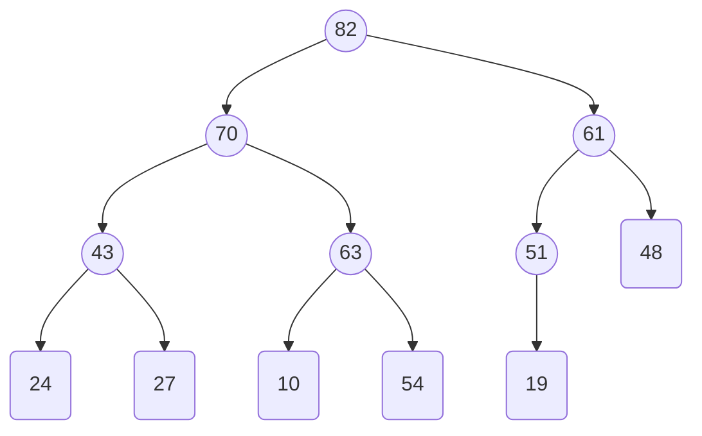
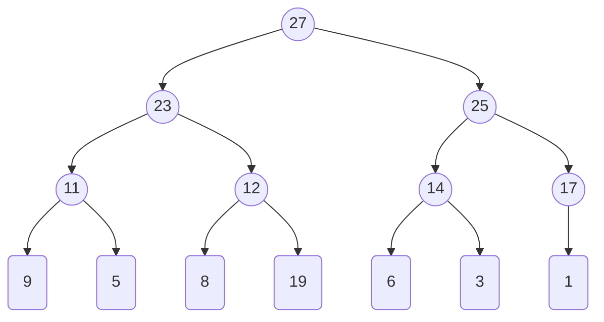

Antonia Tomova, 23-957-590,
Basil Feitknecht, 23-922-099

# 5.1
## (a)
![[A&D-e-u05.pdf#page=1&rect=84,351,558,530|A&D-e-u05, p.1]]

The max-heap obtained after inserting the elements $70$ and $51$ in that order is given below.

## (b)
![[A&D-e-u05.pdf#page=1&rect=84,138,559,351|A&D-e-u05, p.1]]

The max-heap obtained after two `extractMax()` operations is given below.

# 5.3
![[A&D-e-u05.pdf#page=2&rect=65,378,530,472|A&D-e-u05, p.2]]
___
![[A&D-e-u05.pdf#page=2&rect=67,114,528,160|A&D-e-u05, p.2]]

## (a)
![[A&D-e-u05.pdf#page=3&rect=85,666,538,776|A&D-e-u05, p.3]]

We show that the number of comparisons $T(n)$ satisfies the given recurrence relation. 
$$
\begin{align}
& T(1) = 0,
& T(n) = T(n-1) + (n-1), && \forall n \geq 2
\end{align}
$$
To do this, we apply a case distinction on $n$.

**Case** $n=1$

The condition `if l < r` evaluates to false so the algorithm makes no comparisons, thus $T(1)=0$.
$\square$

**Case** $n\geq2$

We use the assumption that `partition(A, l, r)` always performs exactly $r-l$ comparisons. Since, the `if` condition evaluates to true, we call the`partition` method with the arguments $l=1, r=n$. Thus, we perform $n-1$ comparisons.

Then we note that the two recursive function calls on line 4, `quicksort(A, l, k-1)` and line 5, `quicksort(A, k+1, r)` together cover the range $[1, n-1]$, thus they must perform exactly $T(n-1)$ comparisons, by definition of $T$.

So the final formula for the number of comparisons is exactly the recurrence relation, $T(n) = T(n-1) + (n-1), \quad\forall n\geq2$.
$\square$

## (b)
![[A&D-e-u05.pdf#page=3&rect=84,580,537,663|A&D-e-u05, p.3]]

We note, that for $n \geq 3$, we can rewrite the recurrence relation as $T(n) = \big( T(n-2)+(n-2) \big) + (n-1)$. Similarly, for $n \geq 4$, the formula becomes $T(n) = \Big( \big(T(n-3) + (n-3) \big) + (n-2) \Big) + (n-1)$.

We make the observation, that this pattern will continue, i.e. the number of comparisons taken follows the sum from $0$ to $n-1$. This yields the closed form for $T(n)$ stated below.
$$
\begin{align}
T(n) &= \sum_{i=0}^{n-1} i \\
&= \frac{n(n-1)}{2} = \frac{n^{2}-n}{2}
\end{align}
$$

We will now evaluate the limit between $T(n)$ and the function $f(n)=n^{2}$.
$$
\begin{align}
\lim_{ n \to \infty } \frac{T(n)}{f(n)} &= \lim_{ n \to \infty } \frac{\frac{n^{2}-n}{2}}{n^{2}} \\
&= \lim_{ n \to \infty } \frac{n^{2}-n}{2n^{2}} \\
&= \lim_{ n \to \infty } \frac{\cancel{ n^{2} }\left( 1 - \frac{1}{n} \right)}{2\cancel{ n^{2} }}  \\
&= \lim_{ n \to \infty } \frac{1 \cancel{ -\frac{1}{n} }}{2} \\
&=\frac{1}{2} \in \mathbb{R}
\end{align}
$$

Since the limit of the ratio between $T(n)$ and $f(n)$ is a constant, $T(n) = \Theta(n^{2})$.
$\square$

# 5.4
![[A&D-e-u05.pdf#page=3&rect=66,412,530,539|A&D-e-u05, p.3]]
![[A&D-e-u05.pdf#page=3&rect=64,185,531,408|A&D-e-u05, p.3]]
![[A&D-e-u05.pdf#page=3&rect=66,139,534,173|A&D-e-u05, p.3]]

## (a)
Prove that executing $\mathrm{heapify}(T )$ returns a valid heap.
![[A&D-e-u05.pdf#page=4&rect=84,727,531,773|A&D-e-u05, p.4]]

We prove the statement by process of mathematical induction on the given invariant $I(t)$ after $t$ iterations of the outermost `for` loop.

**Base Case** $n=2$

We use a distinction on the case, that the binary tree $T$ already fulfills the heap condition. In this case, $\mathrm{heapify}(T)$ trivially returns valid $H$.

In the case that $T$ does not fulfill the heap condition, the outermost `for` loop iterates once, since the variable $t=\mathrm{height}(T)-1=0$ describing the level iteration is at the root. The node $N$ is then the root, per definition the only node at level $l=0$. Thus the innermost `for` loop also only iterates once.

From our assumption that $T$ does not fulfill the heap condition, it follows that the root node $N$ has a child $C$ such that $\mathrm{key}(C)>\mathrm{key}(N)$. Without loss of generality, let $C_{1} \leftarrow C$. Since $N$ does not have any other children, $\mathrm{key}(C_{2})=-\infty$. Then the first `if` statement executes and swaps $N$ and $C_{1}$ and their keys, restoring the heap condition.

Thus, $I(0)$ holds after executing $\mathrm{heapify}(T)$ on some binary tree $T$ with $n=2$ nodes.

**Induction Hypothesis** $n=k$