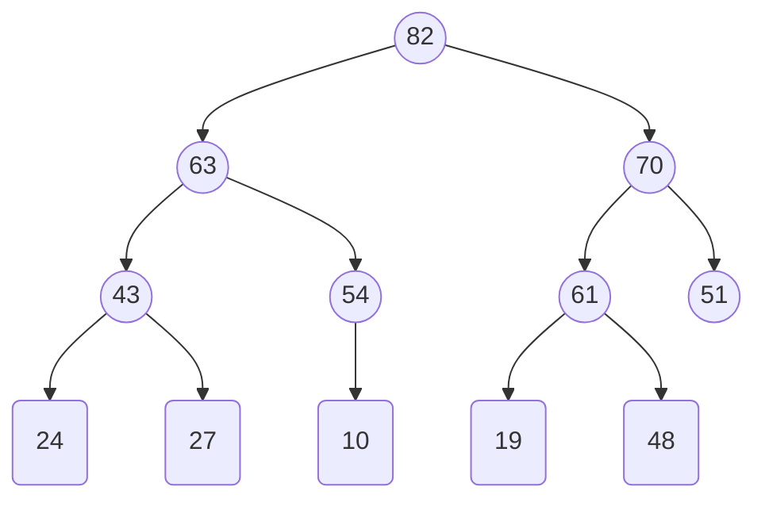
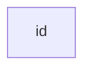

Antonia Tomova, 23-957-590,
Basil Feitknecht, 23-922-099

# 5.1
## (a)
![[A&D-e-u05.pdf#page=1&rect=84,351,558,530|A&D-e-u05, p.1]]

## (b)
![[A&D-e-u05.pdf#page=1&rect=84,138,559,351|A&D-e-u05, p.1]]

# 5.3
## (a)
![[A&D-e-u05.pdf#page=3&rect=85,666,538,776|A&D-e-u05, p.3]]

## (b)
![[A&D-e-u05.pdf#page=3&rect=84,580,537,663|A&D-e-u05, p.3]]

$$
\begin{align}
T(n) &= \sum_{i=0}^{n-1} i \\
&=
\end{align}
$$