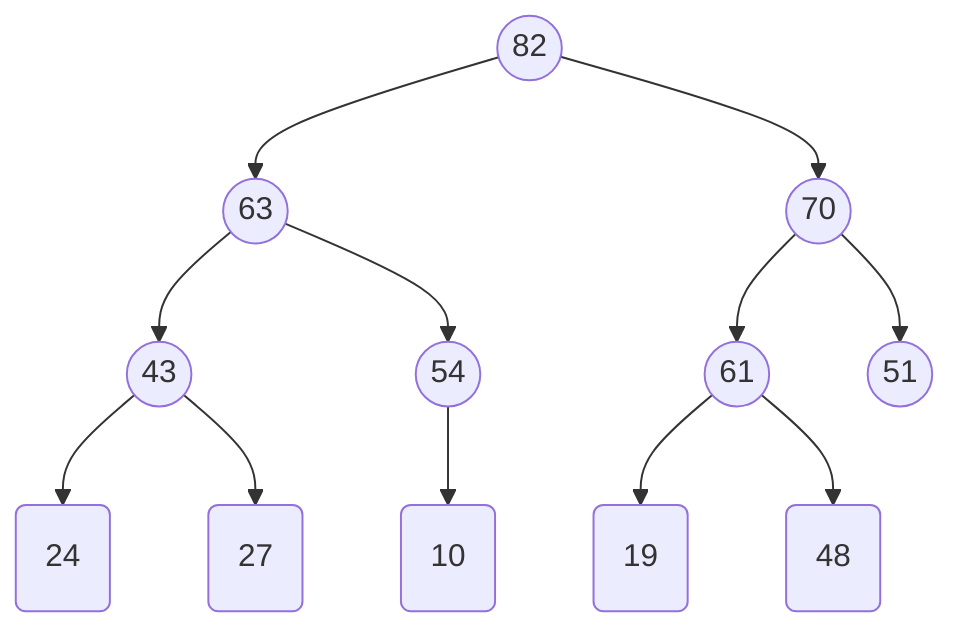
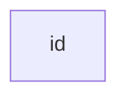

Antonia Tomova, 23-957-590,
Basil Feitknecht, 23-922-099

# 5.1
## (a)
![[A&D-e-u05.pdf#page=1&rect=84,351,558,530|A&D-e-u05, p.1]]

## (b)
![[A&D-e-u05.pdf#page=1&rect=84,138,559,351|A&D-e-u05, p.1]]

# 5.3
## (a)
![[A&D-e-u05.pdf#page=3&rect=85,666,538,776|A&D-e-u05, p.3]]

![[A&D-e-u05.pdf#page=2&rect=65,378,530,472|A&D-e-u05, p.2]]

T(1)=0 because if condition not held
n-1 in first level plus T(n-1) because we skip one element

assumption that partition makes $r-l$ comparisons, not $l-r$!!

## (b)
![[A&D-e-u05.pdf#page=3&rect=84,580,537,663|A&D-e-u05, p.3]]

We note, that for $n\geq2$, blabla

$$
\begin{align}
T(n) &= \sum_{i=0}^{n-1} i \\
&= \frac{(n-1)\cdot n}{2} = \frac{n^{2}-n}{2}
\end{align}
$$

and thus $T(n) = \Theta(n^{2})$

# 5.4
![[A&D-e-u05.pdf#page=3&rect=66,412,530,539|A&D-e-u05, p.3]]
![[A&D-e-u05.pdf#page=3&rect=64,185,531,408|A&D-e-u05, p.3]]
![[A&D-e-u05.pdf#page=3&rect=66,139,534,173|A&D-e-u05, p.3]]

## (a)
Prove that the executing $\mathrm{Heapify}(T )$ returns a valid heap.
![[A&D-e-u05.pdf#page=4&rect=84,727,531,773|A&D-e-u05, p.4]]

induction on invariant, base case $n=2$ nodes and level $l=2$,
