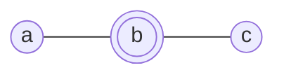
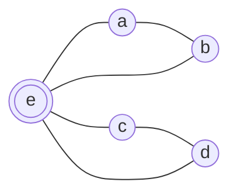
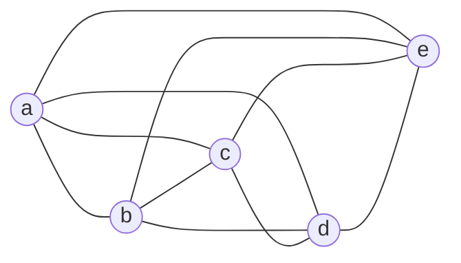
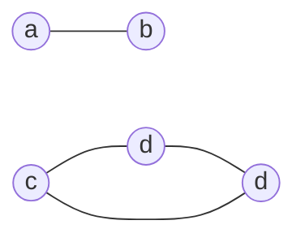

# 8.1   Introduction to Graphs ![[A&D-e-u08.pdf#page=2&rect=67,633,530,751|A&D-e-u08, p.2]]

## (a) ![[A&D-e-u08.pdf#page=2&rect=85,573,528,632|A&D-e-u08, p.2]]
The *players* of the game are modeled as *vertices* and the relation *is on contact list* denotes an undirected edge. Since the relation is symmetric, the graph is undirected. Then the game is winnable if and only if, there exists a hamilton path. Specifically, if there exists a vertex $w \in V$ such that there is no hamilton path starting from $w$, the game is not winnable since this player can't get the message to all the others.
$\square$

## (b) ![[A&D-e-u08.pdf#page=2&rect=86,539,530,568|A&D-e-u08, p.2]]

Observe the following counterexample.


For $a,c \in V$ the game is winnable, since there exists a hamilton path, namely $(a, b, c)$ and $(c,b,a)$. However, starting from $b \in V$ there is no hamilton path and thus the game is not winnable.
$\square$

<div class="page-break" style="page-break-before: always;"></div>

## (c) ![[A&D-e-u08.pdf#page=2&rect=85,431,531,535|A&D-e-u08, p.2]]
In terms of our graph model, the stated conditions translate to the following.
- $\forall v \in V : \deg(v) \leq 2$, every vertex has degree at least two
- $\forall a,b \in V : \exists P=(a, \dots, b)$, any two vertices are reachable from each other

The following counterexample fulfills the requirements stated above and illustrates that the claim is false for $n=5$, since starting from any vertex $v \in V - \{ e \}$ the game is winnable, however starting from $e$ it isn't.

$\square$

<div class="page-break" style="page-break-before: always;"></div>

# 8.5   Short Questions about Graphs

In the following, let $G = (V, E)$ be a graph with $n = |V|$ and $m = |E|$. For statements (b) - (f), decide if the statement is true or false. If it's true, provide a proof, else provide a counterexample.

## (a) ![[A&D-e-u08.pdf#page=4&rect=83,381,529,410|A&D-e-u08, p.4]]
True. Assume for contradiction that there exists two paths $P_{1}, P_{2}$ that start at $v$ and end at $w$ such that $P_{1} \neq P_{2}$. Then we observe the following case distinction on the two paths.

**Paths are disjoint**, $P_{1} \cap P_{2} = \varnothing$
Without loss of generality, traverse one of the paths in reverse order, starting from $w$ to $v$. Then this forms a cycle.

**Paths are not disjoint**, $P_{1} \cap P_{2} \neq \varnothing$
Let $x \in P_{1} \cap P_{2}$ be the vertex where the two paths meet. Without loss of generality, continue the traversal of one path to $w$ and follow the other in reverse order back to $x$. This is a cycle.

Contradiction. The existence of two distinct paths from $w$ to $v$ introduces a cycle but the graph $G$ is a tree, which cannot contain cycles. Thus the statement is proven.
$\square$

## (b) ![[A&D-e-u08.pdf#page=4&rect=85,328,530,344|A&D-e-u08, p.4]]
True. Assume $\forall v \in V : \deg(v) \geq \left\lceil  \frac{n}{2}  \right\rceil$. Then, for any two arbitrary vertices $u, v \in V$, with $u \neq v$ we have either $\{ u, v \} \in E$ or $\mathrm{N}(u) \cap \mathrm{N}(v) \neq \varnothing$, where $\mathrm{N}$ denotes the set of all adjacent vertices. Thus there exists a walk of length $2$ with starting vertex $u$ and ending vertex $v$. Hence, any arbitrary two distinct vertices are in the same connected component. It follows that $G$ is connected.
$\square$

<div class="page-break" style="page-break-before: always;"></div>

## (c) ![[A&D-e-u08.pdf#page=4&rect=85,295,528,325|A&D-e-u08, p.4]]
False. Consider the graph below. We have two hamilton cycles $C, C'$ with $C \cap C' = \varnothing$.


$\square$

## (d) ![[A&D-e-u08.pdf#page=4&rect=85,272,528,290|A&D-e-u08, p.4]]
True. Since there are $n$ vertices, there are $n-1$ possible degrees. This is due to the fact that any vertex $w \in V$ can at most be connected to all other vertices besides itself, i.e. $w' \in V -\{ w \}$. On the other side, a vertex of degree zero $w'' \in V', \deg(w'') = 0$ is not connected to any other vertices so the maximum degree is $n-1\cancel{ -1+1 }$, i.e. the maximum degree from before $\deg(w)=n-1$ minus one, since $w$ is not connected to $w''$ plus one since there is an additional distinct vertex in $V'$, namely the one with degree zero $w''$.

Per pigeonhole principle we have $\left\lceil  \frac{n}{n-1}  \right\rceil = 2$ which implies that there must be $u, v \in V$ such that $\deg(u) = \deg(v)$. Thus the statement is proven.
$\square$

## (e) ![[A&D-e-u08.pdf#page=4&rect=83,238,528,269|A&D-e-u08, p.4]]
False. Consider the following counter example. $G$ is a graph that, for every path $P$ of length at least $|P|\geq 2$, the sum of degree of vertices in the path is even $\sum_{v_{i} \in P}\deg(v_{i}) \equiv_{2} 0$. However, $G$ does not have an eulerian walk.

$\square$

<div class="page-break" style="page-break-before: always;"></div>

## (f) ![[A&D-e-u08.pdf#page=4&rect=84,190,529,235|A&D-e-u08, p.4]]
False. Observe the graph given below.


Specifically, deleting any edge $e \in E$ leaves the graph connected, however deleting the vertex $e$ disconnects the graph. Thus the statement is disproven.
$\square$


```tikz
\usepackage{tikz} 
\usetikzlibrary {graphs}

\begin{document}
\tikz
\graph[nodes={circle,draw}]
{
a -- b -- c
};

\end{document}
```