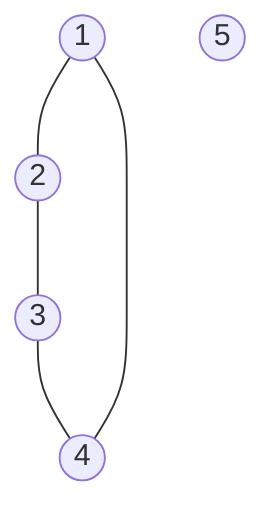

# 8.1   Introduction to Graphs ![[A&D-e-u08.pdf#page=2&rect=67,633,530,751|A&D-e-u08, p.2]]

## (a) ![[A&D-e-u08.pdf#page=2&rect=85,573,528,632|A&D-e-u08, p.2]]

## (b) ![[A&D-e-u08.pdf#page=2&rect=86,539,530,568|A&D-e-u08, p.2]]

## (c) ![[A&D-e-u08.pdf#page=2&rect=85,431,531,535|A&D-e-u08, p.2]]


# 8.5   Short Questions about Graphs

In the following, let $G = (V, E)$ be a graph with $n = |V|$ and $m = |E|$. For statements (b) - (f), decide if the statement is true or false. If it's true, provide a proof, else provide a counterexample.

## (a) ![[A&D-e-u08.pdf#page=4&rect=83,381,529,410|A&D-e-u08, p.4]]

## (b) ![[A&D-e-u08.pdf#page=4&rect=85,328,530,344|A&D-e-u08, p.4]]
True. Assume $\forall v \in V : \deg(v) \geq \left\lceil  \frac{n}{2}  \right\rceil$. Then, for any two arbitrary vertices $u, v \in V$, with $u \neq v$ we have either $\{ u, v \} \in E$ or $\mathrm{N}(u) \cap \mathrm{N}(v) \neq \varnothing$, where $\mathrm{N}$ denotes the set of all adjacent vertices. Thus there exists a walk of length $2$ with starting vertex $u$ and ending vertex $v$. Hence, any arbitrary two distinct vertices are in the same connected component. It follows that $G$ is connected.
$\square$

## (c) ![[A&D-e-u08.pdf#page=4&rect=85,295,528,325|A&D-e-u08, p.4]]

## (d) ![[A&D-e-u08.pdf#page=4&rect=85,272,528,290|A&D-e-u08, p.4]]
False, consider the following counterexample.


```tikz
\usepackage{tikz} 
\usetikzlibrary {graphs}

\begin{document}
\tikz \graph { a -> {b, c} -> d }
\end{document}
```




## (e) ![[A&D-e-u08.pdf#page=4&rect=83,238,528,269|A&D-e-u08, p.4]]

## (f) ![[A&D-e-u08.pdf#page=4&rect=84,190,529,235|A&D-e-u08, p.4]]
