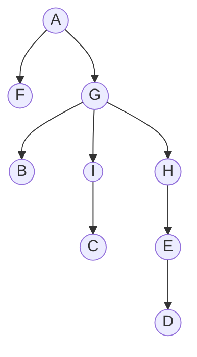

# 10.1      Shortcutting closed Eulerian Walks ![[A&D-e-u10.pdf#page=1&rect=68,335,532,527|A&D-e-u10, p.1]]

The connected graph $H = (V, F)$ on the same $n = |V|$ vertices as the complete graph $G = K_{n}$ has a closed eulerian walk $T = (f_{i})_{k}$, where $f_{i} \in F$ and $k = |F|$. Then, the algorithm presented below iterates through the edges in the given closed eulerian walk and adds the vertices in the order first encountered to the hamilton cycle $C$. Thus it keeps only those that aren't "detours".

Through the metric property of $G$ and the compatibility of edge weights with $H$, skipping over previously visited vertices cannot increase the total weight. Additionally this ensures that every vertex is visited exactly once, as $H$ is connected. It follows that $C$ is a hamilton cycle in $G$ and it holds that $w(C) \leq w'(T)$. Thus the algorithm is correct and satisfies the runtime bounds.

```lua
-- algorithm to convert euler circuit to hamilton cycle
-- @param: H = (V, F), conected graph where n = |V| and k = |F|
-- @param: T = [f] * k, euler circuit in H where f = (u, v) in F with u, v in V
-- @return: C = [v] * (n+1), hamilton cycle in G
-- @runtime: O(|F|)

function euler_to_hamilton(H, T)
    C = {}
    for edge f = (u, v) in T do
        if not u.visited then
            u.visited = true
            C.add(u)
        end
        if not v.visited then
            v.visited = true
            C.add(v)
        end
    end
    C.add(s)    -- where vertex s = starting vertex in T
    return C
end
```
$\square$

<div class="page-break" style="page-break-before: always;"></div>

# 10.2      BFS ![[A&D-e-u10.pdf#page=1&rect=68,239,529,286|A&D-e-u10, p.1]]
![[A&D-e-u10.pdf#page=2&rect=66,569,531,772|A&D-e-u10, p.2]]

## a) ![[A&D-e-u10.pdf#page=2&rect=86,498,530,555|A&D-e-u10, p.2]]

| iteration | operation      | queue           |
| --------- | -------------- | --------------- |
| `0`       | `q.push(A)`    | `q = [A]`       |
| `1`       | `q.pop() -> A` | `q = []`        |
| `2`       | `q.push(F)`    | `q = [F]`       |
| `3`       | `q.push(G)`    | `q = [F, G]`    |
| `4`       | `q.pop() -> F` | `q = [G]`       |
| `5`       | `q.pop() -> G` | `q = []`        |
| `6`       | `q.push(B)`    | `q = [B]`       |
| `7`       | `q.push(H)`    | `q = [B, H]`    |
| `8`       | `q.push(I)`    | `q = [B, H, I]` |
| `9`       | `q.pop() -> B` | `q = [H, I]`    |
| `10`      | `q.pop() -> H` | `q = [I]`       |
| `11`      | `q.push(E)`    | `q = [I, E]`    |
| `12`      | `q.pop() -> I` | `q = [E]`       |
| `13`      | `q.push(C)`    | `q = [E, C]`    |
| `14`      | `q.pop() -> E` | `q = [C]`       |
| `15`      | `q.push(D)`    | `q = [C, D]`    |
| `16`      | `q.pop() -> C` | `q = [D]`       |
| `17`      | `q.pop() -> D` | `q = []`        |

<div class="page-break" style="page-break-before: always;"></div>

## b) ![[A&D-e-u10.pdf#page=2&rect=87,478,530,494|A&D-e-u10, p.2]]

Let $T = (V, E_{T})$ be the shortest path tree for $G$, rooted at the vertex $A \in V$.


## c) ![[A&D-e-u10.pdf#page=2&rect=86,458,531,474|A&D-e-u10, p.2]]

| $k$     | $0$       | $1$          | $2$             | $3$          | $4$       | $5$           |
| ------- | --------- | ------------ | --------------- | ------------ | --------- | ------------- |
| $S_{k}$ | $\{ A \}$ | $\{ F, G \}$ | $\{ B, H, I \}$ | $\{ C, E \}$ | $\{ D \}$ | $\varnothing$ |

## d) ![[A&D-e-u10.pdf#page=2&rect=86,424,530,454|A&D-e-u10, p.2]]

The set of critical edges in $G$ are given below.
$$
S = \{ (A, F), (A,G), (G, B), (G, H), (G, I), (H, E), (I, C) \}
$$

## e) ![[A&D-e-u10.pdf#page=2&rect=85,377,530,420|A&D-e-u10, p.2]]

| `vertex` | `A` | `F` | `G` | `B` | `H`  | `I`  | `E`  | `C`  | `D`  |
| -------- | --- | --- | --- | --- | ---- | ---- | ---- | ---- | ---- |
| `enter`  | `0` | `2` | `3` | `6` | `7`  | `8`  | `11` | `13` | `15` |
| `leave`  | `1` | `4` | `5` | `9` | `10` | `12` | `14` | `16` | `17` |

## f) ![[A&D-e-u10.pdf#page=2&rect=87,344,528,373|A&D-e-u10, p.2]]

| $k$     | $0$ | $1$ | $2$ | $3$  | $4$  | $5$      |
| ------- | --- | --- | --- | ---- | ---- | -------- |
| $t_{k}$ | $1$ | $4$ | $9$ | $14$ | $17$ | $\infty$ |

## g) ![[A&D-e-u10.pdf#page=2&rect=87,321,528,338|A&D-e-u10, p.2]]

| $k$     | $0$       | $1$          | $2$             | $3$          | $4$       | $5$           |
| ------- | --------- | ------------ | --------------- | ------------ | --------- | ------------- |
| $R_{k}$ | $\{ A \}$ | $\{ F, G \}$ | $\{B,  H, I \}$ | $\{ E, C \}$ | $\{ D \}$ | $\varnothing$ |

<div class="page-break" style="page-break-before: always;"></div>

# 10.4      Number of Minimal Paths ![[A&D-e-u10.pdf#page=3&rect=67,652,533,752|A&D-e-u10, p.3]]

To count the number of paths between two distinct vertices $v, v' \in V$ of length $k$, we modify BFS as follows. For every vertex $u \in V$ we keep track of the number of distinct paths reaching it and the distance it has from $v$. Since we explore every edge and visit every vertex at most once, the given algorithm satisfies the runtime constraint of $O(n+m)$. Furthermore, its correctness is given by the fact that all paths of length $l$ are considered before exploring paths of length $l+1$. Thus we account for every path from $v$ to $v'$ that has length $k$.

```lua
-- algorithm to count the number of paths of length k from s to t
-- @param: k, length of paths
-- @param: s, starting vertex v
-- @param: t, target vertex v'
-- @param: G = (V, E), graph as adjacency list
-- @return: p, number of paths of length k from s to t

function paths_of_length(k, s, t, G)
    p = {{}}        -- matrix where p[v][l]: paths from s to v of length l
    p[s][0] = 1        -- starting vertex has one path of length zero to itself
    q = {}            -- queue where (v, d): vertex v at distance d from s
    q.push({s, 0})
    while not q.empty() do
        (u, d) = q.pop()
        if not d == k then
            for v in Adj[u] do
                p[v][d+1] += p[u][d]
                if d+1 <= k then
                    q.push(v, d+1)
                end
            end
        end
    end
    return p[t][k]
end
```
$\square$


