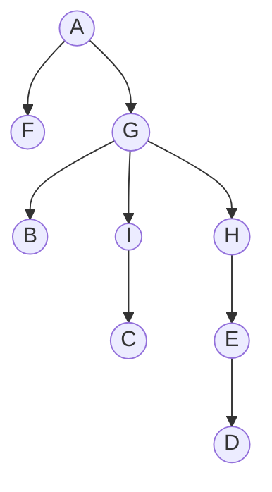

# 10.1      Shortcutting closed Eulerian Walks ![[A&D-e-u10.pdf#page=1&rect=68,335,532,527|A&D-e-u10, p.1]]

We assume the connected graph $H = (V, F)$ on the same $n = |V|$ vertices as the complete graph $G = K_{n}$ has a closed eulerian walk $T = (f_{i})_{k}$.

weight of hamilton cycle in $G$ at most that of closed eulerian walk in $H$

for every edge in $f \in F$, check if the weight in $H$ of that edge is more than that in $G$. if so, remove it and take the edge between those vertices in $G$

# 10.2      BFS ![[A&D-e-u10.pdf#page=1&rect=68,239,529,286|A&D-e-u10, p.1]]
![[A&D-e-u10.pdf#page=2&rect=66,569,531,772|A&D-e-u10, p.2]]

## a) ![[A&D-e-u10.pdf#page=2&rect=86,498,530,555|A&D-e-u10, p.2]]

| iteration | operation      | queue           |
| --------- | -------------- | --------------- |
| `0`       | `q.push(A)`    | `q = [A]`       |
| `1`       | `q.pop() -> A` | `q = []`        |
| `2`       | `q.push(F)`    | `q = [F]`       |
| `3`       | `q.push(G)`    | `q = [F, G]`    |
| `4`       | `q.pop() -> F` | `q = [G]`       |
| `5`       | `q.pop() -> G` | `q = []`        |
| `6`       | `q.push(B)`    | `q = [B]`       |
| `7`       | `q.push(H)`    | `q = [B, H]`    |
| `8`       | `q.push(I)`    | `q = [B, H, I]` |
| `9`       | `q.pop() -> B` | `q = [H, I]`    |
| `10`      | `q.pop() -> H` | `q = [I]`       |
| `11`      | `q.push(E)`    | `q = [I, E]`    |
| `12`      | `q.pop() -> I` | `q = [E]`       |
| `13`      | `q.push(C)`    | `q = [E, C]`    |
| `14`      | `q.pop() -> E` | `q = [C]`       |
| `15`      | `q.push(D)`    | `q = [C, D]`    |
| `16`      | `q.pop() -> C` | `q = [D]`       |
| `17`      | `q.pop() -> D` | `q = []`        |

## b) ![[A&D-e-u10.pdf#page=2&rect=87,478,530,494|A&D-e-u10, p.2]]

Let $T = (V, E_{T})$ be the shortest path tree for $G$, rooted at the vertex $A \in V$.

## c) ![[A&D-e-u10.pdf#page=2&rect=86,458,531,474|A&D-e-u10, p.2]]

| $k$     | $0$       | $1$          | $2$             | $3$          | $4$       | $5$           |
| ------- | --------- | ------------ | --------------- | ------------ | --------- | ------------- |
| $S_{k}$ | $\{ A \}$ | $\{ F, G \}$ | $\{ B, I, H \}$ | $\{ C, E \}$ | $\{ D \}$ | $\varnothing$ |

## d) ![[A&D-e-u10.pdf#page=2&rect=86,424,530,454|A&D-e-u10, p.2]]

The critical edges of $G$ are given below.
$$
\begin{align}
c_{1} &= \{ A, F \} \\
c_{2} &= \{ A, G \} \\
c_{3} &= \{ G, B \} \\
c_{4} &= \{ G, H \} \\
c_{5} &= \{ G, I \} \\
c_{6} &= \{ H, E \} \\
c_{7} &= \{ I, C \}
\end{align}
$$

## e) ![[A&D-e-u10.pdf#page=2&rect=85,377,530,420|A&D-e-u10, p.2]]

| `vertex` | `A` | `F` | `G` | `B` | `H`  | `I`  | `E`  | `C`  | `D`  |
| -------- | --- | --- | --- | --- | ---- | ---- | ---- | ---- | ---- |
| `enter`  | `0` | `2` | `3` | `6` | `7`  | `8`  | `11` | `13` | `15` |
| `leave`  | `1` | `4` | `5` | `9` | `10` | `12` | `14` | `16` | `17` |

## f) ![[A&D-e-u10.pdf#page=2&rect=87,344,528,373|A&D-e-u10, p.2]]

## g) ![[A&D-e-u10.pdf#page=2&rect=87,321,528,338|A&D-e-u10, p.2]]

# 10.4      Number of Minimal Paths ![[A&D-e-u10.pdf#page=3&rect=67,652,533,752|A&D-e-u10, p.3]]

