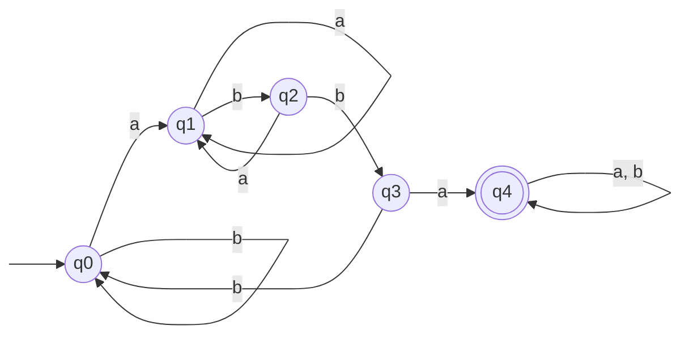
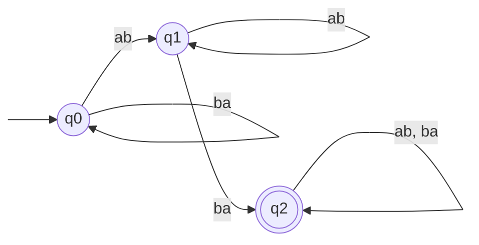
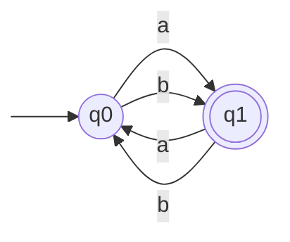

Basil Feitknecht, 23-922-099
Camil Schmid, 23-944-234
Dennis Küenzi, 21-559-315

# 7
![[TI-e-u03.pdf#page=1&rect=67,525,529,575|TI-e-u03, p.1]]

![[hromkovic-TIN.pdf#page=54&rect=41,302,434,330|hromkovic-TIN, p.39]]

![[hromkovic-TIN.pdf#page=56&rect=42,453,432,504|hromkovic-TIN, p.41]]

# 8
![[TI-e-u03.pdf#page=1&rect=64,386,532,491|TI-e-u03, p.1]]

## (a)

The graph representation of a finite automaton $M$ that produces $L_{1}$, i.e. $L(M)=L_{1}$ is

$$
\begin{align}
\mathrm{Kl}[q_{0}] &= \{ b \}^* \cup \{ yabb \mid y \in \Sigma^* \} \\
\mathrm{Kl}[q_{1}] &= \{ yabb \mid y \in \Sigma^* \} \\
\mathrm{Kl}[q_{2}] &= \{  \} \\
\mathrm{Kl}[q_{3}] &= \{ (a^nbb)^m \mid y \in \Sigma^* \} \\
\mathrm{Kl}[q_{4}] &= \{ yabbaz \mid y, z \in  \Sigma^* \}
\end{align}
$$

$M=(Q, \Pi, \delta, q_{0}, F)$, where $Q=\{ q_{0}, q_{1}, q_{2} \}$, $\Pi = \Sigma^2 - \{ aa, bb\}$ and $F=\{ q_{2} \}$. 

## (b)

Informally, this language $L_{2}$ describes all words that contain a different parity amount of $a$ and $b$. This implies that all words in $L_{2}$ have odd length, since the sum of an even and odd number is itself odd.

Formally, we define a finite automaton $M = ( Q, \Sigma, \delta, q_{0}, F )$, where $Q=\{ q_{0}, q_{1} \}$, $\Sigma=\{ a, b \}$ and $F=\{ q_{1} \}$. The transition function is defined for $(p, x) \in Q \times \Sigma$.
$$
\delta(p, x) = \begin{cases}
q_{1}, &\text{if $p=q_{0}$} \\
q_{0}, &\text{else}
\end{cases}
$$

The graphic representation of $M_{2}$ is below.

The equivalence classes of $M_{2}$ are all words with different parities of $a$ and $b$ and equal parities of $a$ and $b$, respectively.
$$
\begin{align}
\mathrm{Kl}[q_{0}] &= \{ w \in \Sigma^* \mid |w|_{a} \not\equiv_{2} |w|_{b} \} \\
\mathrm{Kl}[q_{1}] &= \{ w \in \Sigma^* \mid |w|_{a} \equiv_{2} |w|_{b}  \}
\end{align}
$$

In particular one notes, that all words of odd length are in $\mathrm{Kl}[q_{0}]$ and all words of even length are in $\mathrm{Kl}[q_{1}]$.
$\square$

# 9
![[TI-e-u03.pdf#page=1&rect=68,127,533,349|TI-e-u03, p.1]]

Let $M = \{ Q, \Sigma, \delta_{M}, q_{0}, F \}$ be a finite state machine, where  $Q=\{ q_{0}, q_{1}, q_{2}, q_{3}, q_{4}  \}$ denotes the set of states, $\Sigma=\{ a, b \}$ is the input alphabet, $q_{0}$ is the initial state, $\delta_{M}$ is the transition function between states and $F=\{ q_{0}, q_{3} \}$ is the set of accepted states.

The language accepted by $M$ can be defined as $L(M) = \{ (aa)^n(bb)^m \mid n,m \in \mathbb N  \}$, i.e. all the words that contain an even number of $a$ or $b$, all the words that contain an even amount of $a$ followed by an even amount of $b$ or the empty word $\lambda$.

Furthermore, we define the equivalence classes of all the states.
$$
\begin{align}
\mathrm{Kl}[q_{0}] &= \{ (aa)^n \mid n \in \mathbb N \} \\
\mathrm{Kl}[q_{1}] &= \{ a^n \mid n \in \mathbb N, n \equiv_{2}1 \} \\
\mathrm{Kl}[q_{2}] &= \{ (aa)^nb^m \mid n, m \in \mathbb N , m\equiv_{2}1\} \\
\mathrm{Kl}[q_{3}] &= \{ (aa)^n(bb)^m \mid n,m \in \mathbb N, m\geq1 \} \\
\mathrm{Kl}[q_{4}] &= \Sigma^* - \bigcup_{q_{4}\neq p \in Q} \mathrm{Kl}[p]
\end{align}
$$

