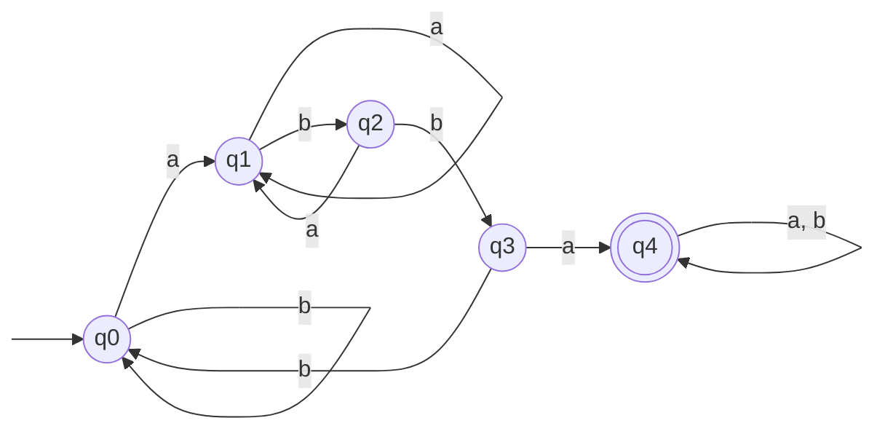
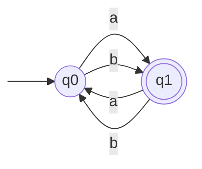

Basil Feitknecht, 23-922-099
Camil Schmid, 23-944-234
Dennis Küenzi, 21-559-315

# 7
![[TI-e-u03.pdf#page=1&rect=67,525,529,575|TI-e-u03, p.1]]
> **Definition 2.19**
> A number $n$ in binary representation is called *random* if $K(n) \geq \lceil \log_{2} (n+1) \rceil -1$.
> 
> **Prime Number Theorem**
> $\lim_{ n \to \infty} \frac{\mathrm{Prim}(n)}{n /\ln (n)} =1$, which can be strengthened to
> $\ln(n)-\frac{3}{2} <\frac{n}{\mathrm{Prin}(n)}< \ln(n)-\frac{1}{2}$, for all $n\geq 67$ 


The idea of the proof is, that for some $N \in \mathbb{N}$, the number of primes up to $N$ that are not random approaches infinity as $N \to \infty$.

Proof by contradiction. Let's assume there is an infinite amount of random primes.

Let $P$ be a program that takes some $i \in \mathbb{N}^+$ and generates the $i$-th prime number. Now we'll construct a program $Q_{n}$ for every $n \in \mathbb{N}^+$ that generates the primes up to $n$. Since $n$ is the only variable part in $Q_{n}$, its kolmogorov complexity is at most $\log_2(n)+c$.

```pascal
begin
	N := n;
	for i := 1 to N do
	   write(P(i));
end
```

The Prime Number Theorem states that the index $i$ of any prime number $p_{i}$ is at most $p_{i} /\ln (p_{i})$ but its length in binary encoding is bounded by $\log_2 (p_{i})$. Since the $i$-th prime number's kolmogorov complexity, $\log_2 (p_{i})$, grows asymptotically faster than kolmogorov complexity  $\log_2(p /\ln(p) )$ our constant $c$ gets infinitely large as we approach $n\to \infty$.

Since $c$ must be finite, we have arrived at a contradiction which implies that the ratio of random primes to primes up to $n$ approaches zero as n approaches infinity, i.e. there are at most a finite amount of random primes per definition 2.19.
$\square$

<!--
•⁠  ⁠proof by contradiction
•⁠  ⁠satz 2.2
•⁠  ⁠get to this: log(p_n) =< K(p_n) =< log(n)  (i just sent a screenshot)
•⁠  ⁠solve the above eq. for n 
•⁠  ⁠use that n in primzahlsatz

For the sake of contradiction, let's assume there are an infinite amount of random prime numbers. Let $P$ be the set of all prime numbers with $p_{n}$ being the $n$-th prime number. Since there exists a program that can solve this decision problem, 
-->

<div class="page-break" style="page-break-before: always;"></div>

# 8
![[TI-e-u03.pdf#page=1&rect=64,386,532,491|TI-e-u03, p.1]]


## (a)

We will construct a finite automaton that accepts $L_{1}$, i.e. $L(M)=L_{1}$.
Let $M=(Q, \Sigma, \delta, q_{0}, F)$, where $Q=\{ q_{0}, q_{1}, q_{2}, q_{3}, q_{4} \}$ is the set of all states, $\Sigma = \{ a,b\}$ is the input alphabet, and $F=\{ q_{4} \}$ is the set of accepted states. 

The graph representation of $M$ follows.


The equivalence classes of the states for some prefix words $w \in \Sigma^*$, where $w$ does not contain the substring $abba$ and doesn't end in $abb$.
$$
\begin{align}
\mathrm{Kl}[q_{0}] &= \Sigma^* - \bigcup_{p \in Q - \{ q_{0} \}} \mathrm{Kl}[p]  \\
\mathrm{Kl}[q_{1}] &= \{ wa \} \\
\mathrm{Kl}[q_{2}] &= \{ wab \} \\
\mathrm{Kl}[q_{3}] &= \{ wabb \} \\
\mathrm{Kl}[q_{4}] &= \{ yabbaz \mid y, z \in  \Sigma^* \}
\end{align}
$$
$\square$

<div class="page-break" style="page-break-before: always;"></div>

## (b)

Informally, this language $L_{2}$ describes all words that contain a different parity amount of $a$ and $b$. This implies that all words in $L_{2}$ have odd length, since the sum of an even and odd number is, again odd.

Formally, we define a finite automaton $M = ( Q, \Sigma, \delta, q_{0}, F )$, where $Q=\{ q_{0}, q_{1} \}$, $\Sigma=\{ a, b \}$ and $F=\{ q_{1} \}$. The transition function is defined for $(p, x) \in Q \times \Sigma$.
$$
\delta(p, x) = \begin{cases}
q_{1}, &\text{if $p=q_{0}$} \\
q_{0}, &\text{else}
\end{cases}
$$

The graph representation of $M_{2}$ is below.


The equivalence classes of $M_{2}$ are all words with equal parity occurrences of $a$ and $b$, and different parity occurrences of $a$ and $b$, respectively.
$$
\begin{align}
\mathrm{Kl}[q_{0}] &= \{ w \in \Sigma^* \mid |w|_{a} \equiv_{2} |w|_{b} \} \\
\mathrm{Kl}[q_{1}] &= \{ w \in \Sigma^* \mid |w|_{a} \not\equiv_{2} |w|_{b}  \}
\end{align}
$$

In particular one notes, that all words of even length are in $\mathrm{Kl}[q_{0}]$ and all words of odd length are in $\mathrm{Kl}[q_{1}]$.
$\square$

<div class="page-break" style="page-break-before: always;"></div>

# 9
![[TI-e-u03.pdf#page=1&rect=68,127,533,349|TI-e-u03, p.1]]


Let $M = \{ Q, \Sigma, \delta_{M}, q_{0}, F \}$ be a finite state machine, where  $Q=\{ q_{0}, q_{1}, q_{2}, q_{3}, q_{4}  \}$ denotes the set of states, $\Sigma=\{ a, b \}$ is the input alphabet, $q_{0}$ is the initial state, $\delta_{M}$ is the transition function between states and $F=\{ q_{0}, q_{3} \}$ is the set of accepted states.

The language accepted by $M$ can be defined as $L(M) = \{ (aa)^n(bb)^m \mid n,m \in \mathbb N  \}$, i.e. all the words that consist of an even number of only $a$ or $b$, all the words that consist of an even number of $a$ followed by an even number of $b$ or the empty word $\lambda$.

Furthermore, we define the equivalence classes of all the states.
$$
\begin{align}
\mathrm{Kl}[q_{0}] &= \{ (aa)^n \mid n \in \mathbb N \} \\
\mathrm{Kl}[q_{1}] &= \{ a^n \mid n \in \mathbb N, n \equiv_{2}1 \} \\
\mathrm{Kl}[q_{2}] &= \{ (aa)^nb^m \mid n, m \in \mathbb N , m\equiv_{2}1\} \\
\mathrm{Kl}[q_{3}] &= \{ (aa)^n(bb)^m \mid n,m \in \mathbb N, m\geq1 \} \\
\mathrm{Kl}[q_{4}] &= \Sigma^* - \bigcup_{p \in Q - \{ q_{4} \}} \mathrm{Kl}[p]
\end{align}
$$

- $\mathrm{Kl}[q_{0}]$ contains the words that consist of an even number of $a$, and the empty word $\lambda$
- $\mathrm{Kl}[q_{1}]$ is defined as the words that consist of an odd number of only $a$
- $\mathrm{Kl}[q_{2}]$ is the words that consist of an even number of $a$ followed by an odd number of $b$ and words that consist of an odd number of only $b$
- $\mathrm{Kl}[q_{3}]$ is words that consist of an even number of $a$ followed by an even number of $b$ and words that consist of an even number of only $b$
- $\mathrm{Kl}[q_{4}]$ is all the rest, i.e. all the words that are not in any of the other classes
$\square$
