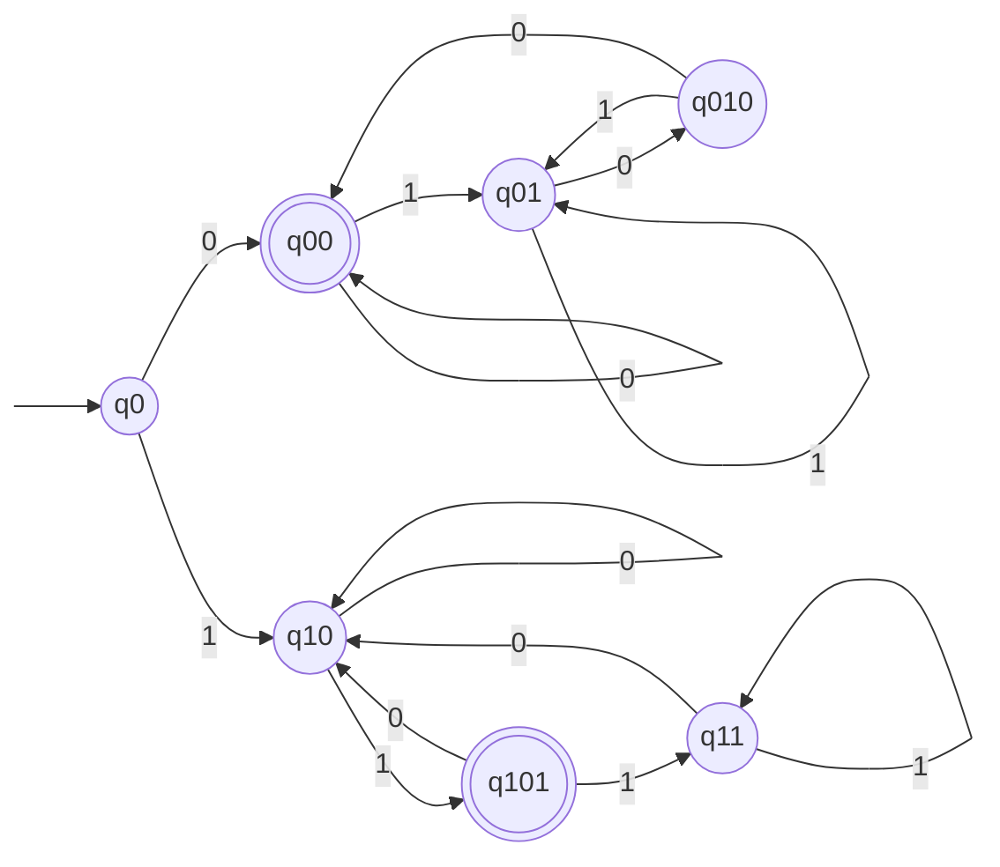
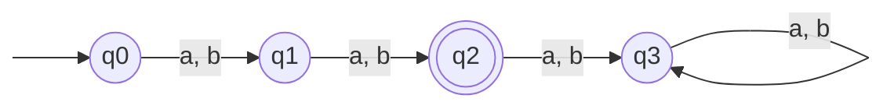
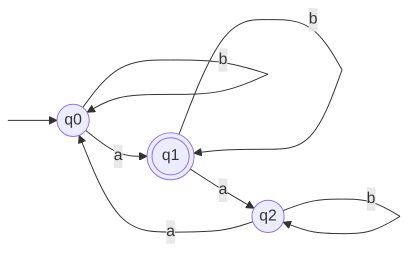
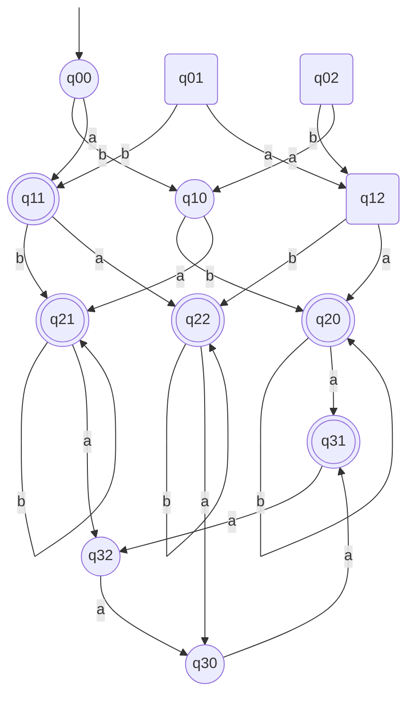

Basil Feitknecht, 23-922-099
Camil Schmid, 23-944-234
Dennis Küenzi, 21-559-315

# 10
![[TI-e-u04.pdf#page=1&rect=67,489,533,572|TI-e-u04, p.1]]

We interpret $\mathrm{Number}(\lambda)=0$, since $\sum_{i=1}^{0}w_{i} \cdot 2^{n-1}=0$. Thus the graph representation of a finite automaton $M$ that accepts the given language, i.e. $L=L(M)$ is given below.

Its states' equivalence classes are the following.
$$
\begin{align}
\mathrm{Kl}[q_{0}] &= L_{\lambda} \\
\mathrm{Kl}[q_{00}] &= \{ 0w00 \mid w \in \Sigma^{*} \} \cup \{ 0, 00 \} \\
\mathrm{Kl}[q_{01}] &= \{ 0w1 \mid w \in \Sigma^{*} \} \\
\mathrm{Kl}[q_{010}] &= \mathrm{Kl}[q_{01}] \cdot \{ 0 \} \\
\mathrm{Kl}[q_{10}] &= \{ 1w0 \mid w \in \Sigma^{*} \} \cup \{ 1 \} \\
\mathrm{Kl}[q_{101}] &= \mathrm{Kl}[q_{10}] \cdot \{ 1 \} \\
\mathrm{Kl}[q_{11}] &= \mathrm{Kl}[q_{101}] \cdot \{ 1 \}
\end{align}
$$
$\square$

# 11
![[TI-e-u04.pdf#page=1&rect=66,354,531,451|TI-e-u04, p.1]]

We define two partial finite automata $M_{1}, M_{2}$, such that $L=L(M_{1})\cup L(M_{2})$. The partial automata are defined over the same input alphabet $\Sigma=\{ a, b \}$. 

The graph representation of $M_{1}$ is as follows.

With its states' equivalence classes being defined as below.
$$
\begin{align}
\mathrm{Kl}[q_{0}] &= L_{\lambda} \\
\mathrm{Kl}[q_{1}] &= \Sigma^{1} \\
\mathrm{Kl}[q_{2}] &= \Sigma^{2} \\
\mathrm{Kl}[q_{3}] &= \Sigma^{3} \cdot \Sigma^{*}
\end{align}
$$

For the second partial automaton, $M_{2}$ its graph representation is this.

And the classes on its states are then this.
$$
\begin{align}
\mathrm{Kl}[q_{0}] &= \{ b \}^{*} \cup \{ w \in \Sigma^{*} \mid |w|_{a}\equiv_{3}0 \} \\
\mathrm{Kl}[q_{1}] &=\mathrm{Kl}[q_{0}] \cdot \{ a \} \cdot \{ b \}^{*} \\
\mathrm{Kl}[q_{3}] &= \Sigma^{*} - (\mathrm{Kl}[q_{0}] \cup \mathrm{Kl}[q_{1}])
\end{align}
$$

The graph representation of the product automaton $M$ is given below.

$\square$

# 12

![[TI-e-u04.pdf#page=1&rect=75,225,532,308|TI-e-u04, p.1]]

Assume $L_1$ is regular. Then there exists a finite automaton $A=(Q, \{a, b, c\}, \delta, q_{0}, F)$ where $L(A)= L_1$. Let’s observe the words $ab,ab^2,...,ab^{|Q|+1}$.
According to the pigeonhole principle there exists some $i,j \in \{1,...,|Q|+1\}$ with $i < j$, where $\delta (q_0, ab^i) = \delta (q_0,ab^j)$.

From lemma 3.3 now follows that for all $z \in \{{a,b,c}\}^{*}$
$$
\begin{align}
ab^iz\in L_1 &\Longleftrightarrow ab^jz\in L_1
\end{align}
$$
Fixing $z = ba^i$ shows that
$$
\begin{align}
ab^iz \in L_1 \\
ab^jz \notin L_1
\end{align}
$$

creating a contradiction and proving that $L_1$ cannot be regular.

![[TI-e-u04.pdf#page=1&rect=76,157,533,224|TI-e-u04, p.1]]

Assuming $L_2$ is regular.
The pumping lemma states that there exists some constant ${n_0} \in \mathbb N$  that fulfills requirements $(i) - (iii)$. 

Let‘s pick the word $w = a^{n_0}aba^{n_0} \in L_2$. Since $|w| = (n_0 + 2 + n_0)\geq {n_0}$, we can decompose $w = yxz$ where
$$
\begin{align}
(i)\quad &|yx| \leq {n_0} \\
(ii)\quad &|x| \geq 1 
\end{align}
$$

This means that $yx$ is fully in $(a)^{n_0}$  $\implies y = a^m \wedge x = a^l$ for some $m + l \leq n_0 \wedge 1 \leq l$.
If we pump $x$ we get following words below.
$$
\begin{align}
yx^1z &\in L_2 \\
yx^2z &\notin L_2
\end{align}
$$

This contradicts $(iii)$ and proves that $L_2$ is not regular.
$\square$
