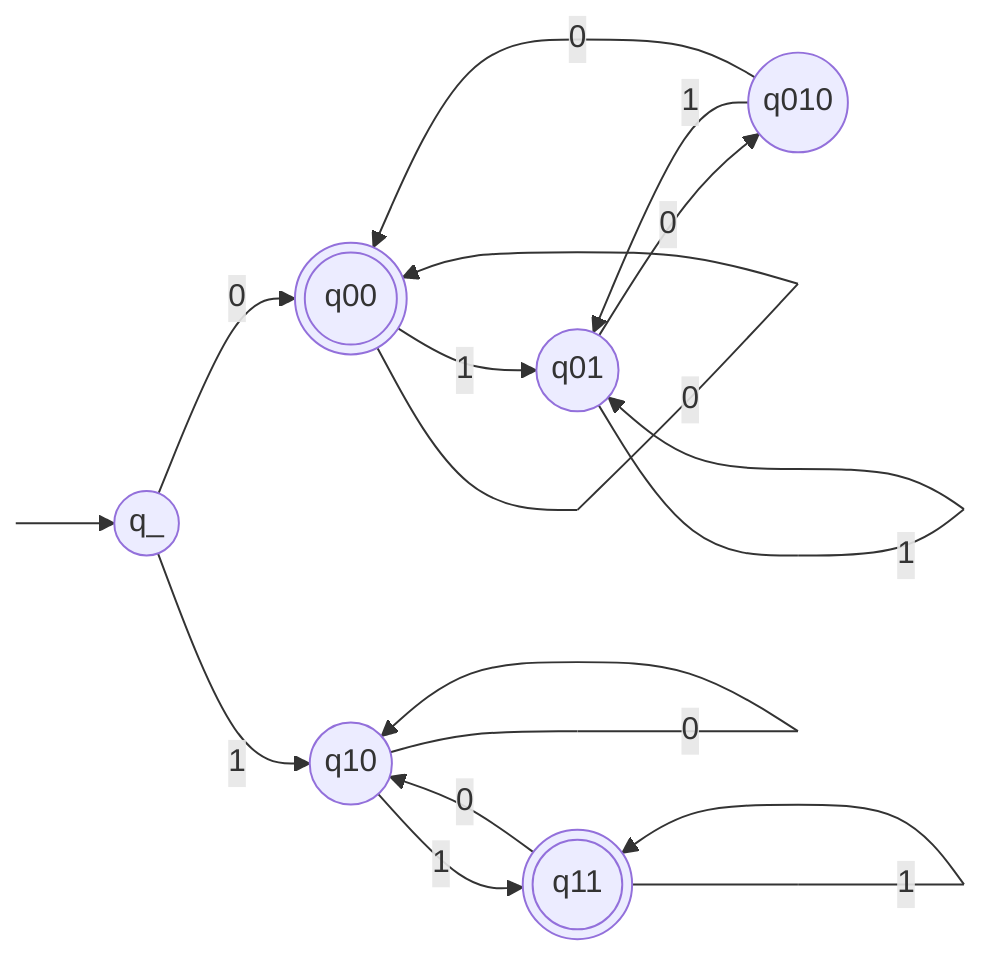
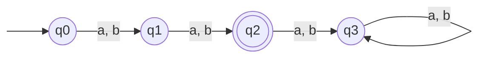
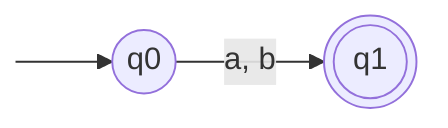

Basil Feitknecht, 23-922-099
Camil Schmid, 23-944-234
Dennis Küenzi, 21-559-315

# 10
![[TI-e-u04.pdf#page=1&rect=67,489,533,572|TI-e-u04, p.1]]

We interpret $\mathrm{Number}(\lambda)=0$. Thus the graph representation of a finite automaton $M$ that accepts the given language, i.e. $L=L(M)$ is given below.

Its states' equivalence classes are the following.
$$
\begin{align}
\mathrm{Kl}[q\_] &= L_{\lambda} \\
\mathrm{Kl}[q_{00}] &= \{ 0 \}^{*} \cup \mathrm{Kl}[q_{010}] \cdot \{ 0 \} \\
\mathrm{Kl}[q_{01}] &= \{ 0w1 \mid w \in \Sigma^{*} \} \\
\mathrm{Kl}[q_{010}] &= \mathrm{Kl}[q_{01}] \cdot \{ 0 \} \\
\mathrm{Kl}[q_{10}] &= \{ 1w0 \mid w \in \Sigma^{*} \} \\
\mathrm{Kl}[q_{11}] &= \{ 1 \}^{*} \cup \mathrm{Kl}[q_{10}]\cdot \{ 1 \}
\end{align}
$$
$\square$

# 11
![[TI-e-u04.pdf#page=1&rect=66,354,531,451|TI-e-u04, p.1]]

mod 3:
0
1
2

$M_{1}$

$M_{2}$

# 12

![[TI-e-u04.pdf#page=1&rect=75,225,532,308|TI-e-u04, p.1]]

![[TI-e-u04.pdf#page=1&rect=76,157,533,224|TI-e-u04, p.1]]
