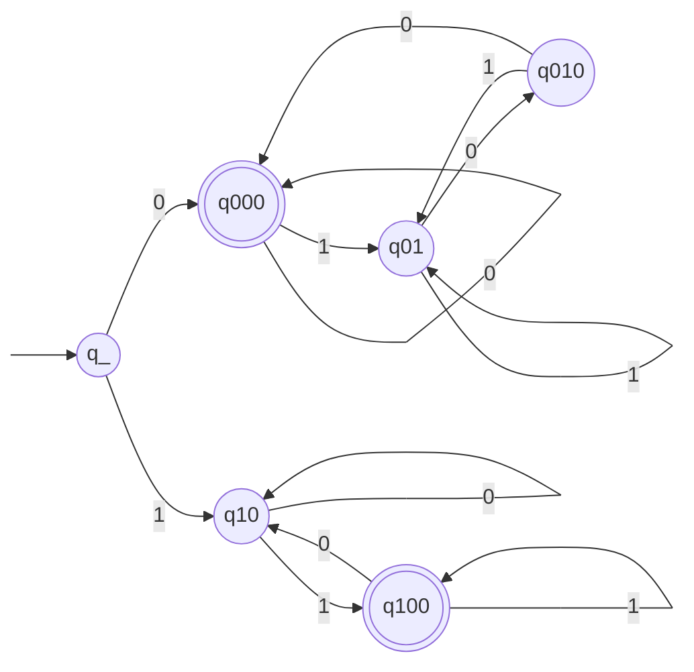

Basil Feitknecht, 23-922-099
Camil Schmid, 23-944-234
Dennis Küenzi, 21-559-315

# 10
![[TI-e-u04.pdf#page=1&rect=67,489,533,572|TI-e-u04, p.1]]

We interpret $\mathrm{Number}(\lambda)=0$. Thus the graph representation of a finite automaton $M$ that accepts the given language, i.e. $L=L(M)$ is given below.

Its states' equivalence classes are the following.
$$
\begin{align}
\mathrm{Kl}[q\_] &= L_{\lambda} \\
\mathrm{Kl}[q_{0}] &= \{ 0 \}^{*} \cup \mathrm{Kl}[q_{4}] \cdot \{ 0 \} \\
\mathrm{Kl}[q_{1}] &= \{ 1 \} \\
\mathrm{Kl}[q_{2}] &= \{  \} \\
\mathrm{Kl}[q_{3}] &= \{ 0 \}^{*} \cup \mathrm{Kl}[q_{5}]\cdot \{ 1 \}  \\
\mathrm{Kl}[q_{4}] &= \{  \} \\
\mathrm{Kl}[q_{5}] &= \{  \}
\end{align}
$$

# 11
![[TI-e-u04.pdf#page=1&rect=66,354,531,451|TI-e-u04, p.1]]

# 12

![[TI-e-u04.pdf#page=1&rect=75,225,532,308|TI-e-u04, p.1]]

![[TI-e-u04.pdf#page=1&rect=76,157,533,224|TI-e-u04, p.1]]
