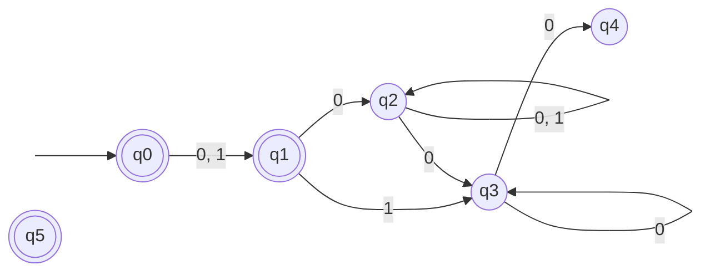

Basil Feitknecht, 23-922-099
Camil Schmid, 23-944-234
Dennis Küenzi, 21-559-315

# 10
![[TI-e-u04.pdf#page=1&rect=67,489,533,572|TI-e-u04, p.1]]

mod 4 : 0, 1, 2, 3

1...01
0...00

# 11
![[TI-e-u04.pdf#page=1&rect=66,354,531,451|TI-e-u04, p.1]]

# 12

![[TI-e-u04.pdf#page=1&rect=75,225,532,308|TI-e-u04, p.1]]

![[TI-e-u04.pdf#page=1&rect=76,157,533,224|TI-e-u04, p.1]]
