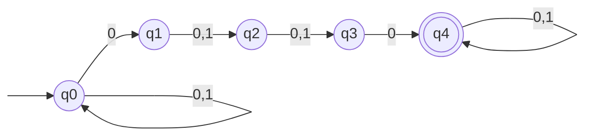
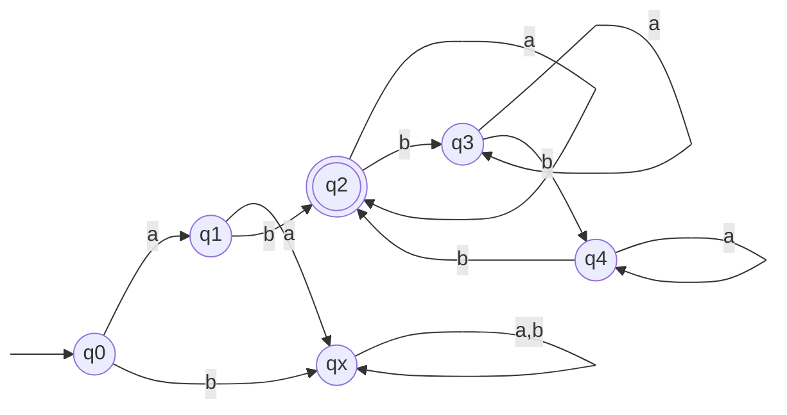

Basil Feitknecht, 23-922-099,
Camil Schmid, 23-944-234,
Dennis Küenzi, 21-559-315

# 13
## (a)
![[TI-e-u05.pdf#page=1&rect=95,510,533,570|TI-e-u05, p.1]]

For the sake of contradiction, let's assume $L_{1}$ to be regular.

We consider the language $L_{w^2} = \{y \mid wwy\in L_{1}\}$. Since $(n+1) \cdot 2 = 2n+2$ for any $n \in \mathbb{N}$, the word $y_{1}=0^{2n+2}$ is the canonical first word of the language $L_{w^{2}}$.

By theorem 3.1 there exists a constant $c$ independent of $m$ such that the following holds.
$$
\begin{align}
K(y_{1}) \leq \lceil \log_{2}(1+1) + c \rceil = 1+c
\end{align}
$$

The number of all programs of length is less than or equal to $1+c$ is finite, but there are an infinite amount of words of the form $0^{2n+2}$, hence we have arrived at a contradiction.
Therefore, $L_1$ is not regular.
$\square$

## (b)
![[TI-e-u05.pdf#page=1&rect=96,463,534,507|TI-e-u05, p.1]]

For the sake of contradiction, assume $L_2 = \{0^2,0^3,0^5,\dots\}$ is regular.
Let $w_{0},w_{1},w_{2},\dots$ be the words of $L_2$ in canonical sequence. According to the Pumping Lemma there exists an $n_{0}\in\mathbb N$, so that conditions $(i)-(iii)$ are fulfilled.

We choose $w=w_{k}=0^{p_{k}}$, where $p_{k}$ is the $k$-th prime number and $p>n_{0}$.

It is easy to see that $|w| \geq n_{0}$ and consequently there exists a decomposition of our words $w=yxz$, where $y=0^{l}, x=0^{m}, z=0^{p-l-m}$, satisfying conditions $(i)-(iii)$.

Per condition $(i)$ it holds that $|xy|=l+m\leq n_{0}$, since we have $|x|=m\leq n_{0}$.

From $(ii)$, it follows that $|x|=m\geq1$.

Because of $|yx^2z| =|yxz| +|x|$, it follows that $|yxz|<|yx^2z|\leq|yxz|+n_{0}$.

The next word in $L_2$ after $w_{k}$ is $w_{k'} =0^{p'}$, where $p'$ is the next prime number after $p$. Thus the following holds.
$$
\begin{align}
|w_{p'}| - |w_{p}| &= p'-p \\
& >1
\end{align}
$$
The strict inequality holds because when $p>2$ the next prime number $p' \geq p+2$.

From this follows that$|w_{p}|<|yx^{2}z|<|w_{p'}|$ and consequently $yx^2z \not\in L_{2}$, while $yxz\in L_{2}$. Hence we have arrived at a contradiction with condition $(iii)$.
$\square$

# 14
## (a)
![[TI-e-u05.pdf#page=1&rect=97,334,531,392|TI-e-u05, p.1]]

The graph representation for a finite automaton accepting $L_{1}$ is given below.

The state $q_{0}$ represents the state that contains all words $x \in \{ 0,1 \}^{*}$. Then, $q_{1}$ contains all words $x0$, where $x \in \{ 0,1 \}*$ i.e. $\mathrm{Kl}[q_{0}] \cdot \{ 0 \}$. Furthermore, $q_{2}$ captures the words $\mathrm{Kl}[q_{1}] \cdot \{ 0,1 \}$ and the state $q_{3}$ is composed of all words $x0y$, where $x \in \{ 0,1 \}^{*}$ and $z \in \{ 0,1 \}^{2}$ i.e. $\mathrm{Kl}[q_{1}]\cdot \{ 0,1 \}^{2}$. Finally, $q_{4}$ contains all words of the form $x0y0z$, where $x,z \in \{ 0,1 \}^{*}$ and $y \in \{ 0,1 \}^{2}$, i.e. the accepted language $\mathrm{Kl}[q_{4}]=L_{1}$.
$\square$

## (b) 
![[TI-e-u05.pdf#page=1&rect=96,269,532,332|TI-e-u05, p.1]]

We first draw the deterministic finite automaton accepting the language $L_{2}$.

For the sake of contradiction, let's assume there exists a finite automaton $M$ that accepts $L_{2}$ and has fewer than six states.

Now we choose the words $B = \{\lambda,a,ab,abb,abbb,b\}$. According to the pigeonhole principle, there exist two words $w_{i},w_{j}\in B, w_{i}\neq w_{j}$, such that $\hat{\delta}(q_0, w_i) = \hat{\delta}(q_0, w_j)$. According to Lemma 3.3, it follows that $\forall z \in \Sigma^* : w_i z \in L \iff w_j z \in L$.

We observe the following table with suffixes.

|           | $a$ | $ab$      | $abb$     | $abbb$    | $b$       |
| --------- | --- | --------- | --------- | --------- | --------- |
| $\lambda$ | $b$ | $\lambda$ | $bb$      | $b$       | $abb$     |
| $a$       |     | $\lambda$ | $bb$      | $ab$      | $b$       |
| $ab$      |     |           | $\lambda$ | $\lambda$ | $\lambda$ |
| $abb$     |     |           |           | $b$       | $bb$      |
| $abbb$    |     |           |           |           | $b$       |
This shows the existence of a suffix $z\in \Sigma^{*}$ for each pair of words $x,y \in B, x\neq y$ , s.t.  $(xz \in L \land yz \notin L) \lor (xz \notin L \land yz \in L)$ holds. This can easily be verified with the given suffixes and the specified EA.

However this contradicts the assumption that there exists a pair of words $w_i, w_j \in B,w_{i}\neq w_{j}$, such that $\forall z \in \Sigma^* : w_i z \in L \iff w_j z \in L$.

Thus, our initial assumption is false, and $L_{2}$ is not regular.
$\square$
