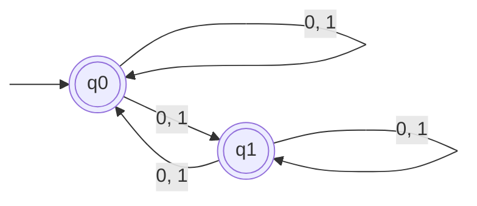

- [[non-deterministic]] [[finite state machine (FSM)]] 
- [[pumping lemma]]
- [[P vs. NP]]
- 

# Notes

- For every deterministic FSM, there exists a non-deterministic FSM and vice versa
- We can't write transitions with $\lambda$!! state transition function is only defined on $Q \times \Sigma$
- Define equivalence classes of states based on each other (concat) but **don't make a cycle!!**
- non-regularity by contradiction with pumping lemma:
	- assume language is regular
	- show first two laws hold for all words ($|yx|\leq n_{0}$ and $|x|\geq 1$)
	- show that no words that are left over satisfy the last rule
- we can only choose the input word $w=yxz$, not the constant $n_{0}$!

Look at vis exams midterm pumping lemma proof structure (ask basil)

![[hromkovic-TIN.pdf#page=93&rect=44,232,438,259|hromkovic-TIN, p.78]]

