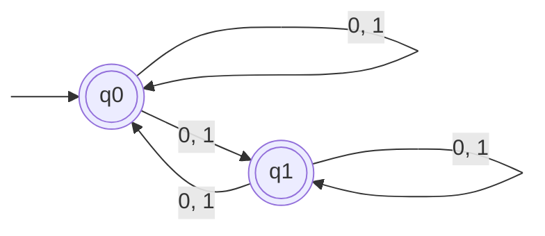

- [[non-deterministic]] [[finite state machine (FSM)]] 
- [[pumping lemma]]

Look at vis exams midterm pumping lemma proof structure (ask basil)

We can't write transitions with $\lambda$, that's not allowed!! state transition function is defined on $Q \times \Sigma$.

![[hromkovic-TIN.pdf#page=93&rect=44,232,438,259|hromkovic-TIN, p.78]]

