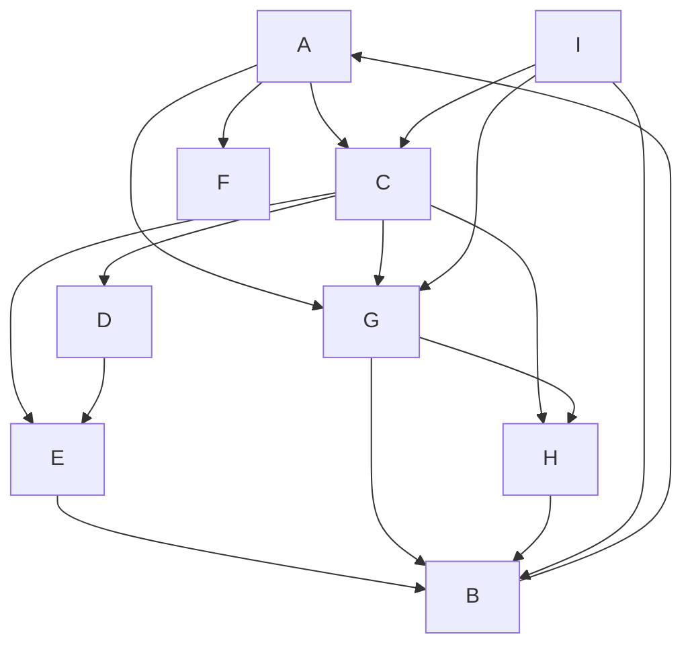

a)
A-->C
A-->F
A-->G
C-->D
C-->E
C-->G
C-->H
G-->B
G-->H

D-->E
E-->B
G-->H

A
A(C, F, G)
C(D, E, G, H), F(), G(B, H)
B(), D(), E(), G(), H() 

A: e1, l2
C: e3, 
F: e4, 
G: e5,

b)
A->B: 2
A->C: 1
A->D: 2
A->E: 2
A->F: 1
A->G: 1
A->H: 2
A->I: $\infty$

