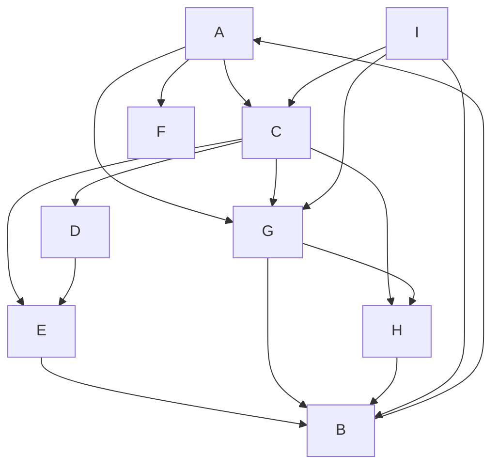

	

```mermaid
graph TD;
	A-->C;
	A-->F;
	A-->G;
	B-->A;
	C-->D;
	C-->E;
	C-->G;
	C-->H;
	D-->E;
	E-->B;
	F;
	G-->B;
	G-->H;
	H-->B;
	I-->B;
	I-->C;
	I-->G;	
```

a)
start at vertex A 

b)
A->B: 2
A->C: 1
A->D: 2
A->E: 2
A->F: 1
A->G: 1
A->H: 2
A->I: $\infty$

