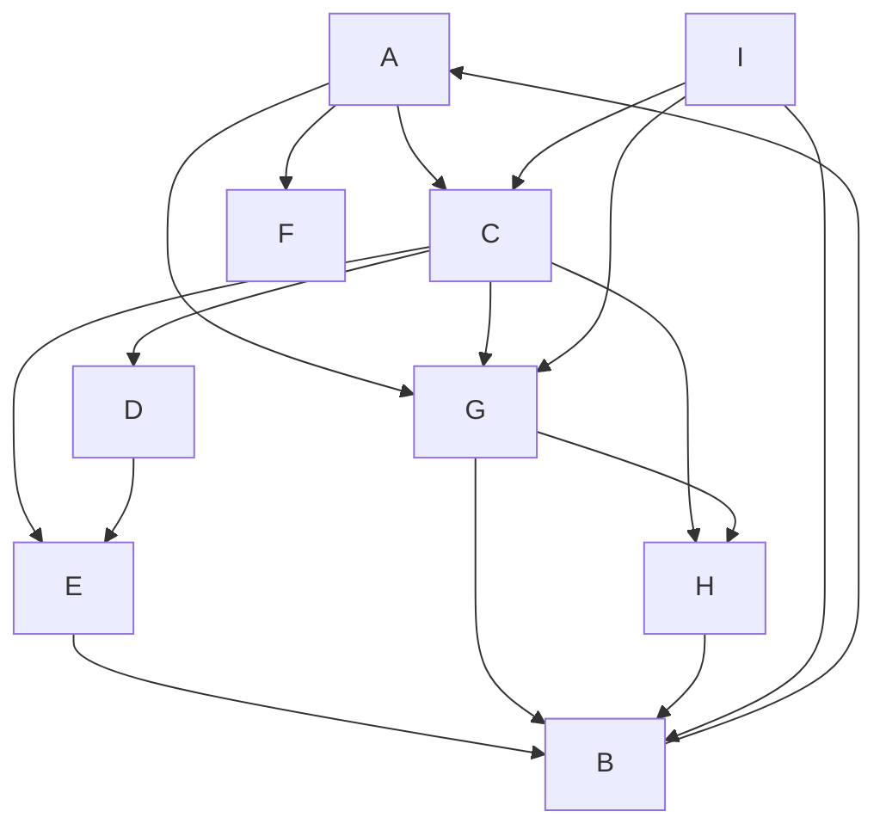

## a)

A) enter: 1, leave: 2
C) enter: 3, leave: 6
F) enter: 4, leave: 10
G) enter: 5, leave: 12
D) enter: 7, leave: 13
E) enter: 8, leave: 14
H) enter: 9, leave: 15
B) enter: 11, leave: 16

___

## b)

A->B: 2
A->C: 1
A->D: 2
A->E: 2
A->F: 1
A->G: 1
A->H: 2
A->I: $\infty$

___

## c)

ACFGDEHB
ACFGDEHB

___

## d)

1
2
3
4
5
6
7
8
9
10
11
12
13
14
15
16
17
18

