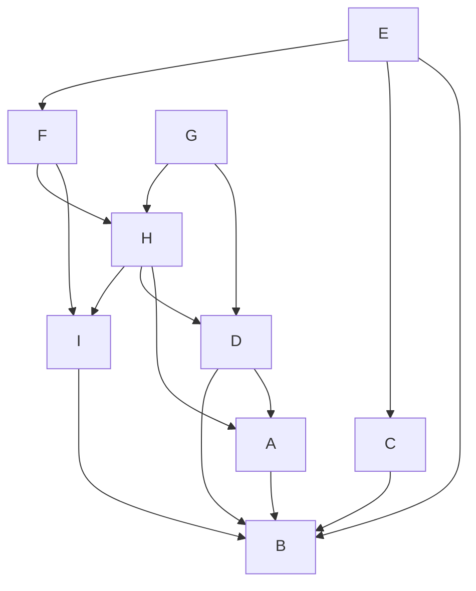

## 9.2

(a) If for every vertex $v \in V$ its in-degree $deg_{in}(v)$ is even, then $|E|$ is even.

**Proof:**
This statement is true. Consider any directed graph G = (V, E) where every vertex v has an even in-degree. We can count the number of edges by summing up the in-degrees of all vertices because each edge contributes to the in-degree of one vertex. Since every in-degree is even, the sum of all in-degrees is even. This implies that the number of edges |E| is also even.

___

(b) For a longest directed path $P : v_0, \dots , v_l$ in $G$, the endpoint has to be a sink.

**Proof:**
This statement is true. Let's assume, for the sake of contradiction, that the longest directed path P has an endpoint vₗ that is not a sink. Since vₗ is not a sink, it must have an outgoing edge. However, this would contradict the maximality of the path P because if we add the outgoing edge from vₗ to the path, we would obtain a longer path, which contradicts the assumption that P is the longest path. Therefore, the endpoint vₗ must be a sink.

This completes the proof, demonstrating that in a directed graph, the endpoint of the longest directed path must be a sink.

___

(b) The following graph has a topological sorting. If so, give a topological sorting; if not, prove why no topological sorting can exist.

To find a topological sorting, we can use the following algorithm:

1. Identify any vertex with in-degree 0 (a vertex with no incoming edges) and add it to the sorting.
2. Remove the chosen vertex and its outgoing edges from the graph.
3. Repeat steps 1-2 until all vertices are in the sorting.

If we successfully perform these steps, we have a topological sorting. If at any point no vertex with in-degree 0 exists, and there are still vertices remaining in the graph, then no topological sorting is possible.

Let's apply this algorithm to the given graph:

1. Choose G (in-degree 0), remove G and its outgoing edges.
2. Choose E (in-degree 0), remove E and its outgoing edges.
3. Choose C (in-degree 0), remove C and its outgoing edges.
4. Choose D (in-degree 0), remove D and its outgoing edges.
5. Choose A (in-degree 0), remove A and its outgoing edges.
6. Choose H (in-degree 0), remove H and its outgoing edges.
7. Choose F (in-degree 0), remove F and its outgoing edges.
8. Choose I (in-degree 0), remove I and its outgoing edges.
9. Choose B (in-degree 0), remove B and its outgoing edges.

The resulting topological sorting is: G, E, C, D, A, H, F, I, B.

Therefore, the given graph has a topological sorting.

## 9.4