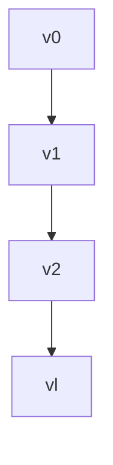

## 9.2

(a) If for every vertex $v \in V$ its in-degree $deg_{in}(v)$ is even, then $|E|$ is even.

**Proof:**
This statement is true. Consider any directed graph G = (V, E) where every vertex v has an even in-degree. We can count the number of edges by summing up the in-degrees of all vertices because each edge contributes to the in-degree of one vertex. Since every in-degree is even, the sum of all in-degrees is even. This implies that the number of edges |E| is also even.

(b) For a longest directed path $P : v_0, \dots , v_l$ in $G$, the endpoint has to be a sink.

**Proof/Counterexample:**
The correctness of this statement depends on the nature of the graph. Let's consider the case where $G$

