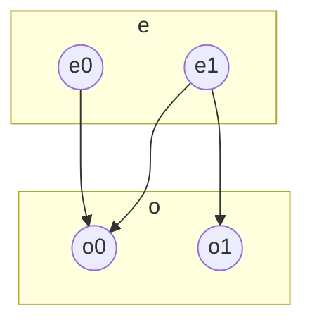
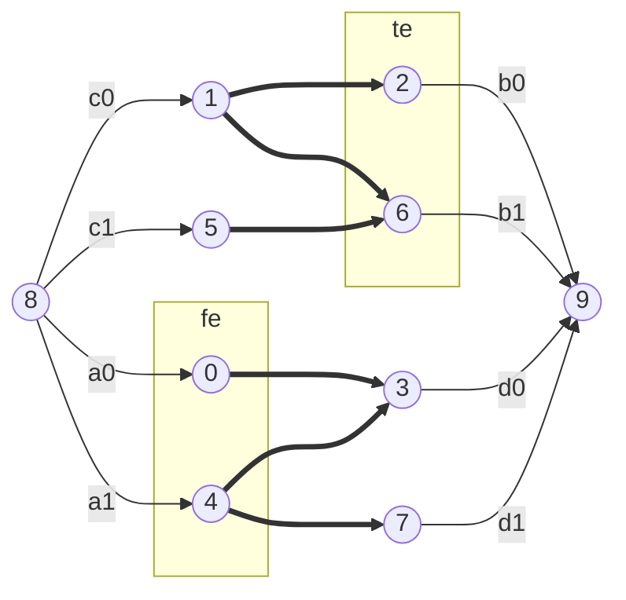

```
n = 2	// evens
m = 2	// odds
K = 3	// friendships

a b		// i-th even need a e_tk, have b o_tk
1 1		
0 0
i

c d		// j-th odd need c o_tk, have d e_tk
0 0
1 1
j

i j		// i-th even f/w j-th odd
0 0
1 0
1 1
```







