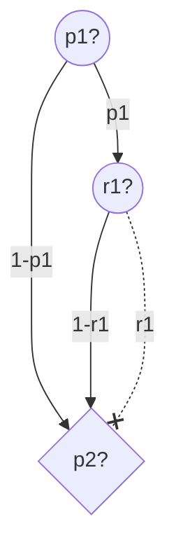
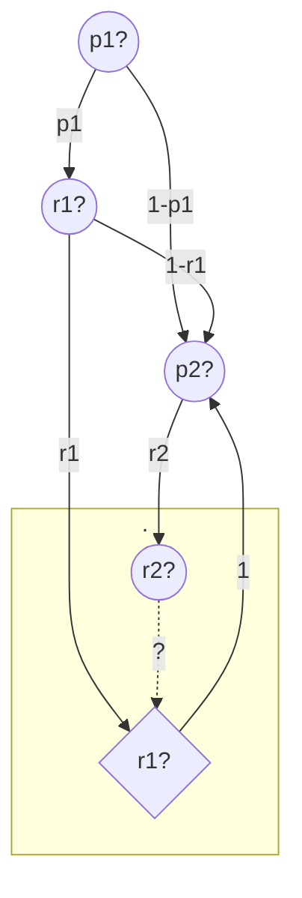
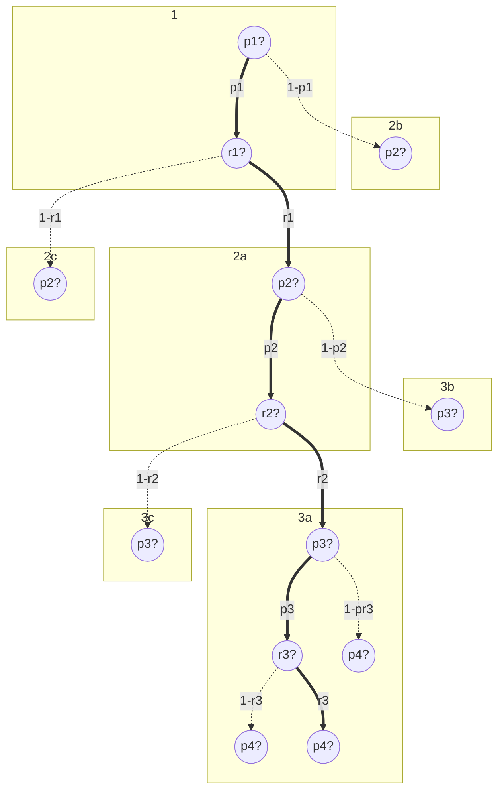
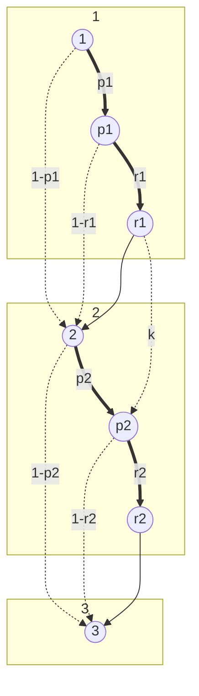
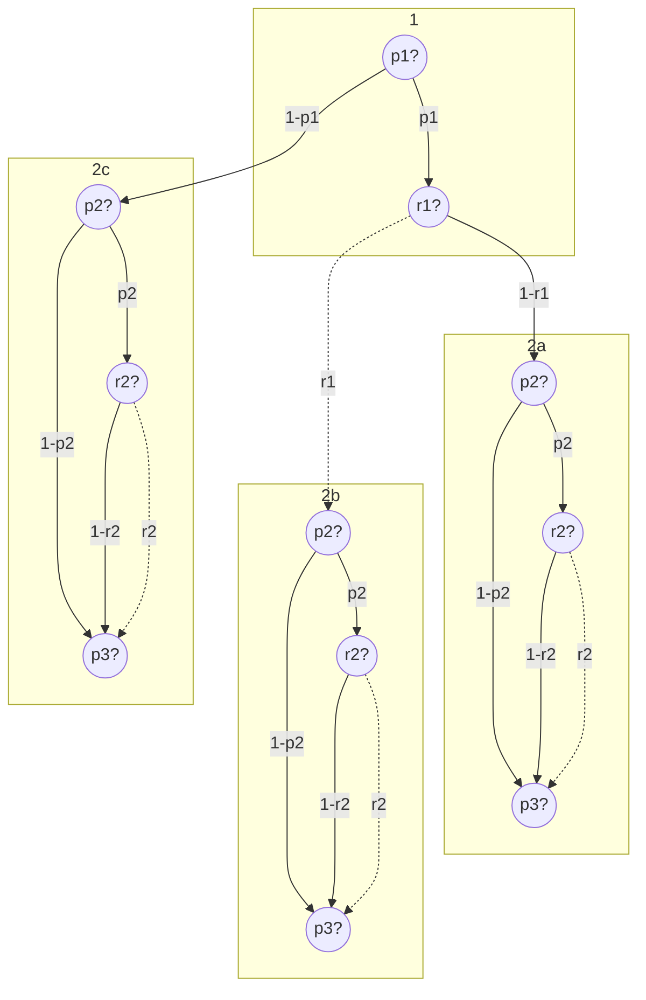

## q1



```java
double exp_not_taken = 0;
for (int i = 0; i < n; i++) {
	exp_not_taken += 1 - (P[i] * R[i]);
}
return exp_not_taken;
```


___
## q2



```java
// A = "first taken"
// B = "second taken"
double p1 = P[1];
double r1 = R[1];
double p2 = P[2];
double r2 = R[2];
double pr_A = p1*r1;
double pr_B = r2 * ((p1*r1) + ((1-p1)*p2) + (p1*(1-r1)*p2));
double pr_A_B = (r2 * pr_A) / pr_B;
return pr_A_B;
```


___
## q3


#### Graphs






#### First Approach

Let $\mathrm{T}$ denote the number of bags taken. By case distinction, there are $\binom{n}{ \mathrm{T}}$ ways for the bags to be taken.
$$
\begin{align}
\binom{n}{0} &= 1  \\ \\
\binom{n}{1} &= n \\ \\
\binom{n}{2} &= \frac{n\cdot(n-1)}{2}  \\ \\
&\dots
\end{align}
$$
For instance, with $\mathrm{X} = 1$, there are $n$ different scenarios. Let us consider the cases, where $\mathrm{X}$ approaches $k$.
$$
\begin{align}
\binom{n}{k} &= \frac{n!}{k!\cdot(n-k)!}  \\ \\
\binom{n}{k+1} &= \frac{n!}{(k+1)!\cdot(n-k+1)!} \\ \\
&\dots
\end{align}
$$
Most notably, when $\mathrm{T} >k$, there exists a permutation where all $k$ first bags are taken. Thus the $k+1$-th bag might be checked with $p_{k+1}=1$ and taken away with $r_{k+1}$. We have to take this probability into account.
$$
\begin{align}
%\mathrm{X} &= \text{"\# bags not taken"} \\
\Pr[\mathrm{X}=0] &= \prod_{i=1}^{k} p_{i} \cdot \prod_{i=1}^{n} r_{i} \\
\\
\\

\Pr[\mathrm{T}=0] &= \prod_{i=1}^{n} 1-(p_{i} \cdot r_{i}) \\
\Pr[\mathrm{T}=1] &= \sum_{i=1}^{n} \left((p_{i} \cdot r_{i}) \cdot \prod_{j\neq i}^{n} 1-(p_{j} \cdot r_{j})\right) \\

\Pr[\mathrm{T}=2] &= ?? 


\\
%\begin{cases}
%1-(p_{i}  \cdot r_{i}), &&\text{if $i \leq k$} \\
%, &&\text{else}
%\end{cases}
\end{align}
$$

#### Notes

>[!Idea]
> up to $X = k$ the probability is as if k were equal to n

>[!attention]
>- Can't have $\mathcal O(n^3)$, but $\mathcal O(n^2)$ is okay.
>- Can't make DP\[n+1|\[n+1] big:
`Exception in thread "main" java.lang.OutOfMemoryError: Java heap space`

```java
double exp_not_taken = 0;
for (int i = 0; i <= n; i++) {
	exp_not_taken += i * pr(i);
}
return exp_not_taken;
```


#### Pseudocode


DP\[i]\[j] = 

$\mathrm{DP}[i][j] = i \text{-th bag taken out of first }j$
$(1-p_{i})+(p_{i}*(1-r_{i}))$

| DP         | 0   | 1                             | 2   | ..  | k   | k+1 | ..  | n-1 | n   | **i** > |
| ---------- | --- | ----------------------------- | --- | --- | --- | --- | --- | --- | --- | ------- |
| 0          | 1   | 0                             | 0   | 0   | 0   | 0   | 0   | 0   | 0   |         |
| 1          | 1   | $(1-p_{1})+(p_{1}*(1-r_{1}))$ | 0   | 0   | 0   | 0   | 0   | 0   | 0   |         |
| 2          | 1   |                               |     |     |     |     |     |     |     |         |
| ..         | 1   |                               |     |     |     |     |     |     |     |         |
| k          | 1   |                               |     |     |     |     |     |     |     |         |
| k+1        | 1   |                               |     |     |     |     |     |     |     |         |
| ..         | 1   |                               |     |     |     |     |     |     |     |         |
| n-1        | 1   |                               |     |     |     |     |     |     |     |         |
| n          | 1   |                               |     |     |     |     |     |     |     |         |
| **j**<br>v |     |                               |     |     |     |     |     |     |     |         |


sliding window dp (?) n\*2 dp-table


|            | 0   | 1   | 2   | ..  | k   | k+1 | k+2 | k+3 |
| ---------- | --- | --- | --- | --- | --- | --- | --- | --- |
| \# streaks | 0   | 0   | 0   | ..  | 0   | 1   | 2   | 3   |
|            |     |     |     |     |     |     |     |     |
|            |     |     |     |     |     |     |     |     |


dp to get probability for each bag, then sum them up
```
double[] E
for i in 1 .. k
	E[i] = p[i] * r[i]
end

// streaks[b][a] = Pr["bags a to b taken"]
double[][] streaks = new double[n+1][]

// streaks ending at b ..
for b in k+1 .. n
	
	// # streaks from a to b, length > k
	streaks[b] = new double[b-k+1]
	
	// .. starting at a
	for a in 1 .. n-k
		streaks[b][a] = streak(a, b)
	end
	
	for streak in streaks[b]
		E[b] += streak
	end
end

```


```java
// E[i] = Pr["i-th bag taken"]
double[] E = new double[n+1];

// streak[a>0] = Pr["all bags from a to current taken"]
double[] streak = new double[n+1];

// streak ending at b ..
for (int b = 1; b <= n; b++) {
	if () {
		
	}
	else
	E[b] = p[b] * r[b];
	
	streak[b] = E[b];
	// .. starting at a
	for (int a = 1; a < b; a++) {
		streak[a] *= E[a];
	}
	
	// sum to E[b] 
	for (double streak : streaks[b]) {
		E[b] += streak;
	}
}
```


```java
// E[i] = Pr["taking i-th bag"]
double[] E = new double[n+1];

// streaks[b][a] = Pr["taking all bags from a to b"]
double[][] streaks = new double[n+1][];

// streaks ending at b ..
for (int b = 1; b <= n; b++) {
	// 1-Pr["k-th bag"] * p[b] * r[b]
	E[b] = (b>k)? (1-streaks[b-1][b-k]) * p[b] * r[b] : p[b] * r[b]; 
	
	streaks[b] = new double[b+1]; // # streaks ending at b
	
	// .. starting at a
	for (int a = 1; a <= b; a++) {
		streaks[b][a] = streaks[b-1][a] * E[b];
		
		if (b-a>k) {
			// when the streak is longer than k
			// modify the probability to take b-th bag
			E[b] += streaks[b][a] * r[b];
		}
	}
}
```


___


addierä und.. minuierä..?


