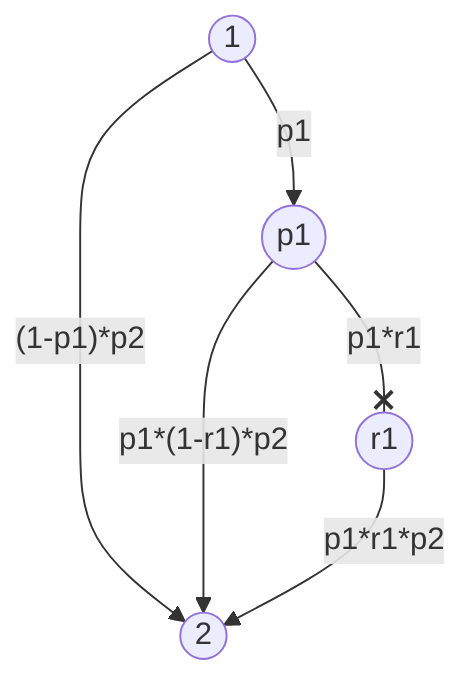
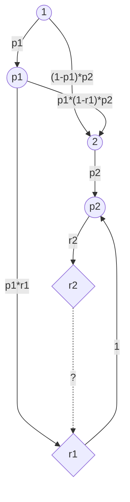

## q1


```java
double exp_not_taken = 0;
for (int i = 0; i < n; i++) {
	exp_not_taken += 1 - (P[i] * R[i]);
}
return exp_not_taken;
```


___
## q2





```java
// A = "first taken"
// B = "second taken"
double p1 = P[1];
double r1 = R[1];
double p2 = P[2];
double r2 = R[2];
double pr_A = p1*r1;
double pr_B = r2 * ((p1*r1) + ((1-p1)*p2) + (p1*(1-r1)*p2));
double pr_A_B = (r2 * pr_A) / pr_B;
return pr_A_B;
```


___
## q3


| $n$ | $p_{i}$ | $r_i$ |
| --- | ------- | ----- |
| 1   | 0.3     | 0.7   |
| 2   | 0.7     | 0.2   |
| 3   | 0.8     | 0,8   |
| 4   | 0.2     | 0.3   |


