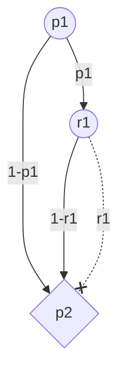
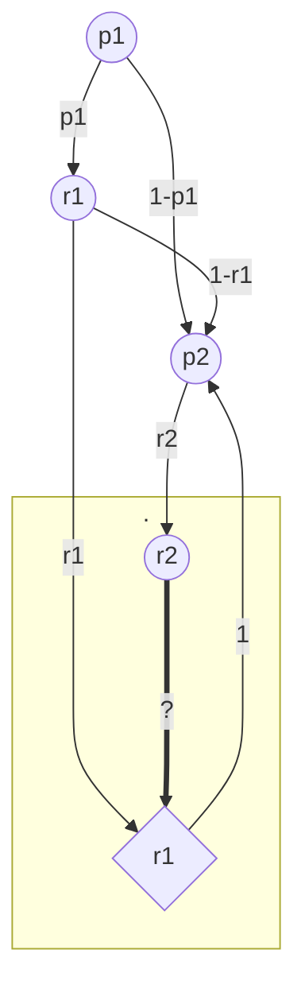

## q1



```java
double exp_not_taken = 0;
for (int i = 0; i < n; i++) {
	exp_not_taken += 1 - (P[i] * R[i]);
}
return exp_not_taken;
```


___
## q2



```java
// A = "first taken"
// B = "second taken"
double p1 = P[1];
double r1 = R[1];
double p2 = P[2];
double r2 = R[2];
double pr_A = p1*r1;
double pr_B = r2 * ((p1*r1) + ((1-p1)*p2) + (p1*(1-r1)*p2));
double pr_A_B = (r2 * pr_A) / pr_B;
return pr_A_B;
```


___
## q3


Let $\mathrm{Y}$ denote the number of bags taken. By case distinction, there are $\binom{n}{ \mathrm{Y}}$ ways for the bags to be taken.
$$
\begin{align}
\binom{n}{0} &= 1  \\ \\
\binom{n}{1} &= n \\ \\
\binom{n}{2} &= \frac{n\cdot(n-1)}{2}  \\ \\
&\dots
\end{align}
$$
For instance, for $\mathrm{X} = 1$, there are $n$ different scenarios. Let us consider the cases, where $\mathrm{X}$ approaches $k$.
$$
\begin{align}
\binom{n}{k} &= \frac{n!}{k!\cdot(n-k)!}  \\ \\
\binom{n}{k+1} &= \frac{n!}{(k+1)!\cdot(n-k+1)!} \\ \\
&\dots
\end{align}
$$
Most notably, when $\mathrm{Y} >k$, there exists a permutation where all $k$ first bags are taken. Thus the $k+1$-th bag is definitely checked and taken away with $r_{k+1}$. We have to take this probability into account.


$$
\begin{align}
%\mathrm{X} &= \text{"\# bags not taken"} \\
\Pr[\mathrm{X}=0] &= \prod_{i=1}^{k} p_{i} \cdot \prod_{i=1}^{n} r_{i} \\
\\
\\

\Pr[\mathrm{Y}=0] &= \prod_{i=1}^{n} 1-(p_{i} \cdot r_{i}) \\
\Pr[\mathrm{Y}=1] &= \sum_{i=1}^{n} (p_{i} \cdot r_{i}) \cdot \left(\prod_{j\neq i}^{n} 1-(p_{j} \cdot r_{j})\right) \\
\Pr[\mathrm{Y}=2] &= ?? 


\\
%\begin{cases}
%1-(p_{i}  \cdot r_{i}), &&\text{if $i \leq k$} \\
%, &&\text{else}
%\end{cases}
\end{align}
$$


maybe we need a different approach. what we want to do now iscalculate the probability for each random variable and then take the expected value.

maybe we need to caclulate the expected value directly, with dp.

like exp_v i


| $\Pr[\mathrm{X_{i}}]$ |                                                            |
| --------------------- | ---------------------------------------------------------- |
| 0                     | first k)		pr_picked \* pr_taken \*<br>rest)			pr_taken<br> |
| 1                     |                                                            |
|                       |                                                            |


```java
double exp_not_taken = 0;
for (int i = 0; i <= n; i++) {
	exp_not_taken += i * pr(i);
}
return exp_not_taken;
```


$\mathrm{DP}[i][j] = i \text{-th bag taken out of first }j$
$(1-p_{i})+(p_{i}*(1-r_{i}))$

| DP         | 0   | 1                             | 2   | ..  | k   | k+1 | ..  | n-1 | n   | **i** > |
| ---------- | --- | ----------------------------- | --- | --- | --- | --- | --- | --- | --- | ------- |
| 0          | 1   | 0                             | 0   | 0   | 0   | 0   | 0   | 0   | 0   |         |
| 1          | 1   | $(1-p_{1})+(p_{1}*(1-r_{1}))$ | 0   | 0   | 0   | 0   | 0   | 0   | 0   |         |
| 2          | 1   |                               |     |     |     |     |     |     |     |         |
| ..         | 1   |                               |     |     |     |     |     |     |     |         |
| k          | 1   |                               |     |     |     |     |     |     |     |         |
| k+1        | 1   |                               |     |     |     |     |     |     |     |         |
| ..         | 1   |                               |     |     |     |     |     |     |     |         |
| n-1        | 1   |                               |     |     |     |     |     |     |     |         |
| n          | 1   |                               |     |     |     |     |     |     |     |         |
| **j**<br>v |     |                               |     |     |     |     |     |     |     |         |


___


