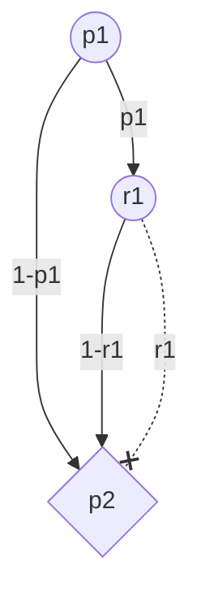
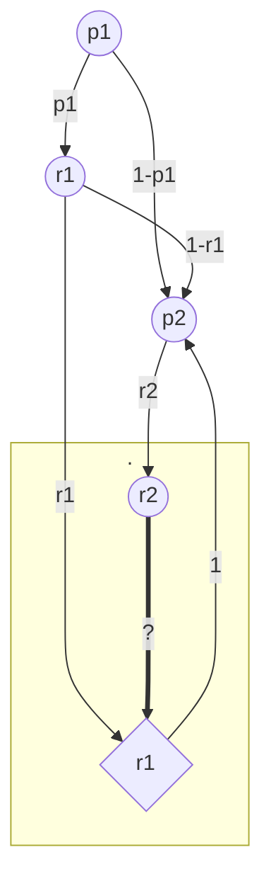

## q1



```java
double exp_not_taken = 0;
for (int i = 0; i < n; i++) {
	exp_not_taken += 1 - (P[i] * R[i]);
}
return exp_not_taken;
```


___
## q2



```java
// A = "first taken"
// B = "second taken"
double p1 = P[1];
double r1 = R[1];
double p2 = P[2];
double r2 = R[2];
double pr_A = p1*r1;
double pr_B = r2 * ((p1*r1) + ((1-p1)*p2) + (p1*(1-r1)*p2));
double pr_A_B = (r2 * pr_A) / pr_B;
return pr_A_B;
```


___
## q3


```java
double exp_not_taken = 0;
for (int i = 0; i <= n; i++) {
	exp_not_taken += i * pr(i);
}
return exp_not_taken;
```


$\mathrm{DP}[i][j] = i \text{-th bag taken out of first }j$
$(1-p_{i})+(p_{i}*(1-r_{i}))$

| DP         | 0   | 1                             | 2   | ..  | k   | k+1 | ..  | n-1 | n   | **i** > |
| ---------- | --- | ----------------------------- | --- | --- | --- | --- | --- | --- | --- | ------- |
| 0          | 1   | 0                             | 0   | 0   | 0   | 0   | 0   | 0   | 0   |         |
| 1          | 1   | $(1-p_{1})+(p_{1}*(1-r_{1}))$ | 0   | 0   | 0   | 0   | 0   | 0   | 0   |         |
| 2          | 1   |                               |     |     |     |     |     |     |     |         |
| ..         | 1   |                               |     |     |     |     |     |     |     |         |
| k          | 1   |                               |     |     |     |     |     |     |     |         |
| k+1        | 1   |                               |     |     |     |     |     |     |     |         |
| ..         | 1   |                               |     |     |     |     |     |     |     |         |
| n-1        | 1   |                               |     |     |     |     |     |     |     |         |
| n          | 1   |                               |     |     |     |     |     |     |     |         |
| **j**<br>v |     |                               |     |     |     |     |     |     |     |         |
