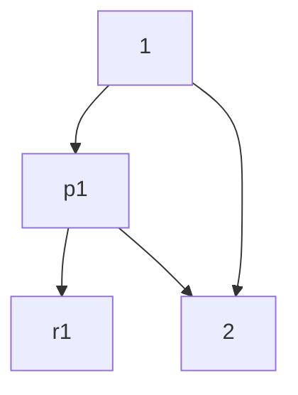

| $n$ | $p_{i}$ | $r_i$ |
| --- | ------- | ----- |
| 1   | 0.3     | 0.7   |
| 2   | 0.7     | 0.2   |
| 3   | 0.8     | 0,8   |
| 4   | 0.2     | 0.3   |
|     |         |       |



id1((1)) -- "p1" --> id2(("1"));
id1((1)) -- "1-p1+ --> id3((2));

%```mermaid
graph TD;
id1((1)) -- "checked" --> id2((7));
id1((2)) --> id3((5));
id2((7)) --> id4((2));
id2((7)) --> id5((10));
id2((7)) --> id6((6));
id3((5)) --> id7((9));
id7((9)) --> id8((4));
id6((6)) --> id9((5));
id6((6)) --> id10((11));
```%
