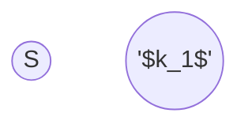

use flow algorithm?

what are the nodes, what is the capacity?

![[network-flow-multi-source&sink.png]]
![[network-flow-multi-source&sink-img.png]]

![[network-flow-vertex-capacity.png]]
![[network-flow-vertex-capacity-img.png]]

Help me save this problem:

Like every New Year, Santa Claus is giving away presents to children. This year he wants to approach the problem in a more systematic way. There are 𝑛 children, denoted by 0,1,…,𝑛−1, and Santa estimated for each child how good they were in the current year, which translates into how many toys they should get. Furthermore, Santa has 𝑚 different types of toys available, denoted by 0,…,𝑚−1, and for each type 𝑖 he can get 𝑐𝑖 copies of toys of that type. While it is fine if some of the toys are not given to anybody, Santa wants to make sure that each child receives the number of toys he/she deserves. Moreover, a single child should not get two toys of the same type. Please, help Santa determine if such a toy allocation is possible.
