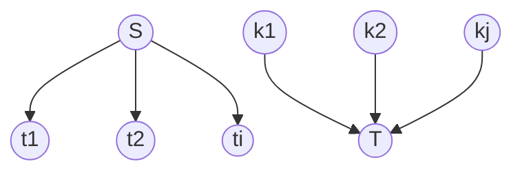

use flow algorithm?

what are the nodes, what is the capacity?





![[network-flow-multi-source&sink.png]]
![[network-flow-multi-source&sink-img.png]]


![[network-flow-vertex-capacity.png]]
![[network-flow-vertex-capacity-img.png]]


```java
 public static boolean possible() {
	int n = In.readInt(); // number of children
	int m = In.readInt(); // number of different toys
	int S = 0;            // supersource
	int T = n+m+1;        // supersink
	int D = 0;            // total deserved toys
      
	Graph G = new Graph(n+m+2);
	for (int i = 1; i <= n+m; i++) {
		if (i <= n) {             	// iterate over kids
			int d = In.readInt();   // how many toys i-th kid deserves
			G.addEdge(i, T, d);     // connect kid to sink w/ capacity d
			D += d;                 // sum to total deserved toys
		}
		else {                    	// iterate over toy types
			int c = In.readInt();   // how many copies of i-th toy
			G.addEdge(S, i, c);     // connect source to toy type w/ capacity c
			for (int j = 1; j <= n; j++)	// iterate over kids
				G.addEdge(i, j, 1);         // connect toy to kid w/ capacity c
		}
	}
	return D == G.computeMaximumFlow(S, T);
}
```