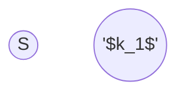

use flow algorithm?

what are the nodes, what is the capacity?

![[network-flow-multi-source&sink.png]]
![[network-flow-multi-source&sink-img.png]]

![[network-flow-vertex-capacity.png]]
![[network-flow-vertex-capacity-img.png]]
