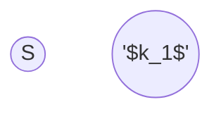

use flow algorithm?

what are the nodes, what is the capacity?





![[network-flow-multi-source&sink.png]]
![[network-flow-multi-source&sink-img.png]]


![[network-flow-vertex-capacity.png]]
![[network-flow-vertex-capacity-img.png]]


```java
public static void deliveryPossible() {
	int n = In.readInt(); // number of children
	int m = In.readInt(); // number of different toys
	int S = 0;            // supersource
	int T = n+m+1;        // supersink
	int D = 0;            // total deserved toys
      
    Graph G = new Graph(n+m+2);
    for (int i = 1; i <= n+m; i++) {
        if (i <= n) {
			int d = In.readInt();
			G.addEdge(i, T, d);
			D += d;
        }
        else {
			int c = In.readInt();
			G.addEdge(S, i, c);
			for (int j = 1; j <= n; j++)
				G.addEdge(i, j, 1);
        }
    }
	boolean possible = D == G.computeMaximumFlow(S, T);
	Out.println(possible? "yes" : "no");
}
```