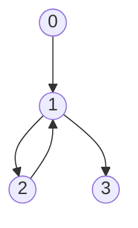

```
n	=	4
m	=	4
v	= 	[1, 2, 3, 2]	
p	=	[12, 6, 3, 5]
d	=	[4, 1, 8, 13]

0 --> 1
1 --> 2
2 --> 1
1 --> 3
```


$v_i \simeq \text{"favorite food"}$, only eat food variety $v_i$ if produced in city $i$.