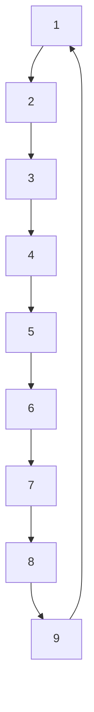

![[AuW-u02-e.pdf]]

## a)

Let $G = (V, E)$ be the 4-regular Graph representing the playing cards. Thus,$$
\begin{align}
& V = \{\mathbb Z_9^* + 1 \times \{\diamondsuit, \clubsuit, \heartsuit, \spadesuit\} \} \\
& E=\{(v_1, v_2) \in V \times V \ | \ v_1 \prec v2 \}
\end{align}
$$where the function $\nu := V \rightarrow \mathbb Z_9$, maps every card to its numerical value and the relation $\prec := \nu(v_1) + 1 \equiv_9 \nu(v_2)$ on $V$ defines, if a given card comes one before another. Note, that we assume the card values to loop back on themselves.


The algorithm is thus:
```
if (true) print("yes")
```

Let $G'=(V', E')$, where $V' = E' = \varnothing$ and let $S_1, S_2, \dots S_9$ as described. Furthermore, let $f:= V \rightarrow \mathbb Z_4^*$ denote, how often we have seen a given card's numerical value. We construct the graph as follows:
$$
\begin{align}
% & S = \bigcup_{i = 1}^9  \\
& V' = \bigcup_{i \in \mathbb Z^*_9 + 1} v \in S_i  : f_{\max}(v), \forall v' \in V' \ \nu(v) \neq \nu(v')   \\ %
& V' \implies E' 
\end{align}
$$
By construction, the graph contains one card from every stack, that together form a straight (Strasse).
$\square$

## b)
