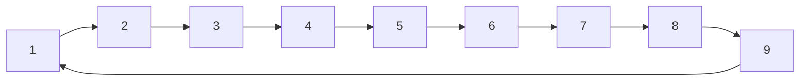

![[AuW-u02-e.pdf]]

## a)

Let $G = (V, E)$ be the connected 4-regular Graph representing the playing cards.
For the purpose of simplicity, let$$
\begin{align}
	& 1 \simeq \text{"6"} \\
& 2 \simeq \text{"7"} \\
& 3 \simeq \text{"8"} \\
& 4 \simeq \text{"9"} \\
& 5 \simeq \text{"10"} \\
& 6 \simeq \text{"Under"} \\
& 7 \simeq \text{"Ober"} \\
& 8 \simeq \text{"König"} \\
& 9 \simeq \text{"Ass"} \\
\end{align}
$$be the mapping of numerical values to card values. Note, that this mapping is arbitrarily chosen and does not influence the outcome. Thus,$$
\begin{align}
& V = \{\mathbb Z_{9}^* \times \{\diamondsuit, \clubsuit, \heartsuit, \spadesuit\} \} \\
& E=\{(v_1, v_2) \in V \times V \ | \ v_1 \prec v_2 \}
\end{align}
$$where the function $\nu : V \rightarrow \mathbb Z_9^*$, maps every card to its numerical value and the relation $\prec \overset{def}{=} \nu(v_1) + 1 \equiv_9 \nu(v_2)$ on $V$ defines, if a given card comes one before another. Note, that we assume the card values to loop back on themselves.


The algorithm is thus:
```
// straight-possible(stack S1, S2, ... S9)

map cards = {}
for stack Si do
	for card cj in stack Si do
		cards.put(cj.suit, cj.value)
	end
end

if cards.keys().size() != 4 print("No") end    // not four suits
for suit in cards.keys() do
	if suit.size() != 9 print("No") end   // not 9 cards per suit
end

print("Yes")    // deck complete => straight possible
```


___

## b)

```
// pick-cards(stack S1, S2, ... S9)

picked = {}
for stack Si do
	card ci_fmax = {}
	for card cj in stack Si
		if f(cj) > f(ci_fmax) do
			if !picked.contains(val(cj)) do
				picked.add(cj)
			elseif !picked.contains(val(ci_fmax)) do
				picked.add(ci_fmax)
			else backtrack() end
		end
	end
end

function backtrack()
	picked.pop()    // remove card last added
	go back to last decision
	if !pick-different-possible do backtrack()
	else pick-different end
end

print(picked)
```


Let $G'=(V', E')$ and let $S_1, S_2, \dots S_9$ as described. Furthermore, let $f: V \rightarrow \mathbb Z_4^*$ denote, how often we have seen a given card's numerical value.
We construct the graph as follows:
$$
\begin{align}
& V' = \bigcup_{i \in \mathbb Z^*_9} v \in S_i  : f_{\max}(v), \forall v' \in V' \ \nu(v) \neq \nu(v')   \\
& V' \implies E' \\
\end{align}
$$
By construction, the graph contains one card from every stack, that together form a straight (Strasse).
$\square$
