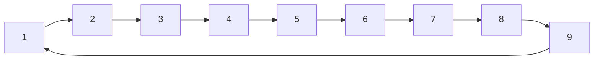

![[AuW-u02-e.pdf]]

<div style="page-break-after: always;"></div>

# a)

Let $G = (V, E)$ be the connected 4-regular Graph representing the playing cards.
For the purpose of simplicity, let$$
\begin{align}
	& 1 \simeq \text{"6"} \\
& 2 \simeq \text{"7"} \\
& 3 \simeq \text{"8"} \\
& 4 \simeq \text{"9"} \\
& 5 \simeq \text{"10"} \\
& 6 \simeq \text{"Under"} \\
& 7 \simeq \text{"Ober"} \\
& 8 \simeq \text{"König"} \\
& 9 \simeq \text{"Ass"} \\
\end{align}
$$be the mapping of numerical values to card values. Note, that this mapping is arbitrarily chosen and does not influence the outcome. Thus,$$
\begin{align}
& V = \{\mathbb Z_{9}^* \times \{\diamondsuit, \clubsuit, \heartsuit, \spadesuit\} \} \\
& E=\{(v_1, v_2) \in V \times V \ | \ v_1 \prec v_2 \}
\end{align}
$$where the function $\nu : V \rightarrow \mathbb Z_9^*$, maps every card to its numerical value and the relation $\prec \overset{def}{=} \nu(v_1) + 1 \equiv_9 \nu(v_2)$ on $V$ defines, if a given card comes one before another. Note, that we assume the card values to loop back on themselves.


The algorithm is thus:
```
// straight-possible(stack S1, S2, ... S9)

map cards = {}
for stack Si do
	for card cj in stack Si do
		cards.put(cj.suit, cj.value)
	end
end

if cards.keys().size() != 4 print("No") end    // not four suits
for suit in cards.keys() do
	if suit.size() != 9 print("No") end   // not 9 cards per suit
end

print("Yes")    // deck complete => straight possible
```

$

___

# b)

Let $G'=(V', E')$ and let $S_1, S_2, \dots S_9$ as described. Furthermore, let $f: V \rightarrow \mathbb Z_4^*$ denote, how often we have seen a given card's numerical value.
We construct the graph as follows:
$$
\begin{align}
& V' = \bigcup_{i \in \mathbb Z^*_9} v \in S_i  : f_{\max}(v), \forall v' \in V' \ \nu(v) \neq \nu(v')   \\
& V' \implies E' \\
\end{align}
$$
By construction, the graph contains one card from every stack, that together form a straight (Strasse).

```
// pick-cards(stack S1, S2, ... S9)

picked = {}
for stack Si do
	card ci_fmax = {}
	for card cj in stack Si
		if f(cj) > f(ci_fmax) do
			if !picked.contains(val(cj)) do
				picked.add(cj)
			elseif !picked.contains(val(ci_fmax)) do
				picked.add(ci_fmax)
			else backtrack() end
		end
	end
end

function backtrack()
	picked.pop()    // remove card last added
	go back to last decision
	if !pick-different-possible do backtrack()
	else pick-different end
end

print(picked)
```

A more efficient approach is to use the fact, that $G$ is 4-regular and bipartite (let the two partitions be the cards in stacks with odd index and the cards in stacks with even index, i.e. $A = S_1 \cup S_3 \cup S_5 \cup S_7 \cup S_9$,  $B = S_2 \cup S_4 \cup S_6 \cup S_8$,  $G = A \oplus B$). We can use the Hopcroft-Karp algorithm to find a perfect matching (which exists, since $G$ is bipartite). We pick all cards in the perfect matchings vertex set.

**Runtime analysis**
Graph construction: $\mathcal O(36) = \mathcal O(1)$ 
Hopcroft-Karp algorithm: $\mathcal O()


___
DO NOT GRADE !!!

An even more efficient approach is to use the fact, that $G$ is 4-regular and bipartite (let the two partitions be the cards with even numerical value and the cards with odd numerical value). We can use the following algorithm:

```
// linear-pick-cards(G)

E = euler-tour(G)     // euler-tour of G
2F = every-other(E)   // 2-factor of G
M1 = every-other(2F)   // perfect matching of G, colors = {a, b}
M2 = every-other(2F)   // perfect matching of G, colors = {c, d}, M1 ≠ M2

P = 2-color(M1) xor 2-color(M2)   // 4-colored set of edges
picked = 1-color set in P
print(picked)

function euler-tour(G)
	return euler tour of G
end

function every-other(G)
	E' = remove every other edge from E
	return G = (V, E')
end

function 2-color(G)
	for edge in E alternate color
end
```

