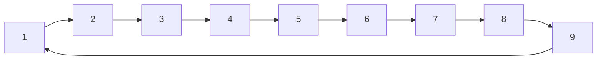

![[AuW-u02-e.pdf]]

## a)

Let $G = (V, E)$ be the 4-regular Graph representing the playing cards. Thus,$$
\begin{align}
& V = \{\mathbb Z_{9}^* \times \{\diamondsuit, \clubsuit, \heartsuit, \spadesuit\} \} \\
& E=\{(v_1, v_2) \in V \times V \ | \ v_1 \prec v2 \}
\end{align}
$$where the function $\nu : V \rightarrow \mathbb Z_9^*$, maps every card to its numerical value and the relation $\prec \overset{def}{=} \nu(v_1) + 1 \equiv_9 \nu(v_2)$ on $V$ defines, if a given card comes one before another. Note, that we assume the card values to loop back on themselves.


The algorithm is thus:
```
if (true) print("yes")
```

Let $G'=(V', E')$ and let $S_1, S_2, \dots S_9$ as described. Furthermore, let $f: V \rightarrow \mathbb Z_4^*$ denote, how often we have seen a given card's numerical value.
$$
\nu(v) =
\begin{cases}
1, \quad v \in \text{"6"}  \times \{\diamondsuit, \clubsuit, \heartsuit, \spadesuit\} \\
2, \quad v \in \text{"7"}  \times \{\diamondsuit, \clubsuit, \heartsuit, \spadesuit\} \\
3, \quad v \in \text{"8"}  \times \{\diamondsuit, \clubsuit, \heartsuit, \spadesuit\} \\
4, \quad v \in \text{"9"}  \times \{\diamondsuit, \clubsuit, \heartsuit, \spadesuit\} \\
5, \quad v \in \text{"10"}  \times \{\diamondsuit, \clubsuit, \heartsuit, \spadesuit\} \\
6, \quad v \in \text{"Under"}  \times \{\diamondsuit, \clubsuit, \heartsuit, \spadesuit\} \\
7, \quad v \in \text{"Ober"}  \times \{\diamondsuit, \clubsuit, \heartsuit, \spadesuit\} \\
8, \quad v \in \text{"König"}  \times \{\diamondsuit, \clubsuit, \heartsuit, \spadesuit\} \\
9, \quad v \in \text{"Ass"}  \times \{\diamondsuit, \clubsuit, \heartsuit, \spadesuit\} \\
\end{cases}
$$
We construct the graph as follows:
$$
\begin{align}
& V' = \bigcup_{i \in \mathbb Z^*_9} v \in S_i  : f_{\max}(v), \forall v' \in V' \ \nu(v) \neq \nu(v')   \\
& V' \implies E' \\
\end{align}
$$
By construction, the graph contains one card from every stack, that together form a straight (Strasse).
$\square$

## b)
