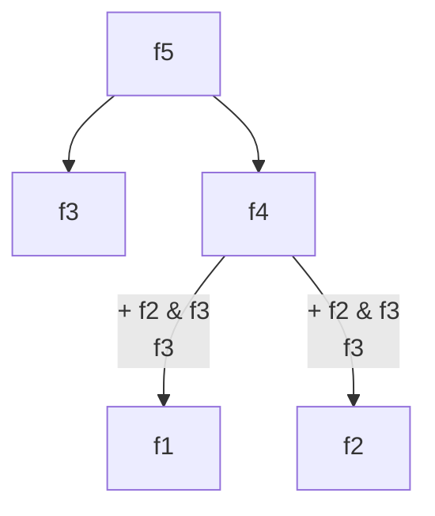

Let $F_n, n\in\N$ be the $n$-th fibonacci number. The recurrence relation can be defined as follows:

[decision parametrization](https://www.youtube.com/watch?v=gK8KmTDtX8E)
[from recurrence relation to iterative execution](https://www.youtube.com/watch?v=NA7u5GTh6fw)
