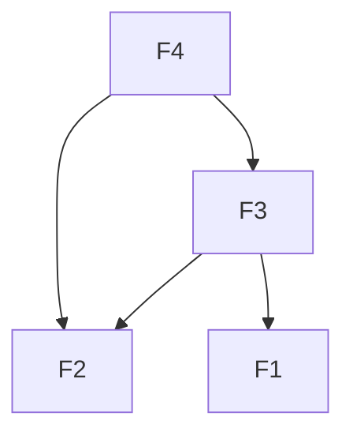
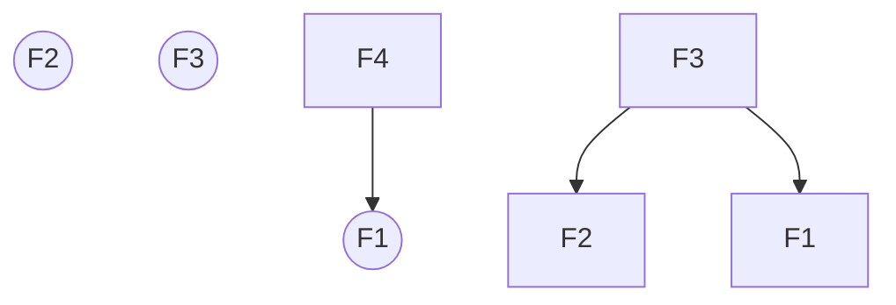

For some $n\in \N$, the $n$-th fibonacci number, $F_{n}, n\in\N$ be the $n$-th [[fibonacci number]]. The [[recurrence relation]] is given by $F_{n} = F_{n-1} +F_{n-2}$ and is modelled by the following [[DAG]]:

The recursive execution (call stack) of computing the function is modelled by the following [[tree]]:

[decision parametrization](https://www.youtube.com/watch?v=gK8KmTDtX8E)
[from recurrence relation to iterative execution](https://www.youtube.com/watch?v=NA7u5GTh6fw)
