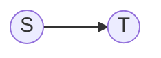

A ([[deterministic]]) **finite state machine** (FSM) is a [[tuple|quintuple]] $M =(Q, \Sigma, \delta, q_{0}, F)$, where 

1. $Q$ is a finite, non-empty [[set]] of *states*
2. $\Sigma$ is an [[alphabet]], called *input alphabet*
3. $\delta:Q \times\Sigma \to Q$ is the *state-transition [[function]]*
4. $q_{0}\in Q$ is the *initial state*
5. $F\subseteq Q$ is the set of *accepted states*

A *configuration* of $M$ is a [[tuple]] of *state* $q$ and input word $w$ in the cartesian product of all possible states and all possible input words $(q, w) \in Q\times\Sigma^*$ and denotes that $M$ exists in the *state* $(q, w) \in Q \times \Sigma^*$ but has yet to read the [[substring|suffix]] $w$ of the input [[word]].

A configuration $(q_{0}, x)\in \{q_{0}\} \times\Sigma^*$ is called *initial configuration* of $M$ on $x$.
Every configuration in $Q\times \{\lambda \}$ is called an *end configuration*.

A *step* of $M$ is a [[relation]] on configurations, $\vdash_{M} \subseteq (Q\times\Sigma^*)\times(Q\times\Sigma^*)$, defined by
$(q, w) \vdash_{M} (p, x) \iff w=ax, a \in \Sigma$, where $\delta(q, a) = p$. A step corresponds to evaluating the transition function on the current configuration of $M$ (meaning it's in state $q$ and reads the input symbol $a$), resulting in a transition to state $p$.

A *computation* $C$ of $M$ is a finite [[sequence]] of steps $C=(C_{i})_{i=0}^n$ of configurations, where $C_{i}\vdash_{M}C_{i+1},\forall i\in[n-1]$.
We call $C$ a computation of $M$ *on the input* $x\in\Sigma^*$ if $C_{0}=(q_{0},x)$ and $Q_{n}\in Q \times \{\lambda\}$ is an end configuration.
If $C_{n}\in F\times\{\lambda\}$ we say that $C$ is an *accepting computation* of $M$ on $x$ and that $M$ *accepts*the word $x$. In the case that $C_{n}\in (Q-F) \times\{\lambda\}$ we say that $C$ is a *rejecting* computation of $M$ on $x$ and that $M$ *rejects* (doesn't accept) the word $x$.

It's noted that $M$ has exactly one computation for every input $x\in\Sigma^*$.

The [[language]] $L(M)$ *accepted* by $M$ is defined as the set of all words in $w\in\Sigma^*$ such that the computation on $w$ is accepted, i.e. it ends in some end configuration $(q, \lambda)$ with $q\in F$.

The class of all languages accepted by finite state machines is denoted by $\mathcal L_{EA}$. It's also called the *class of regular languages* and every language $L$ in $\mathcal L_{EA}$ is called *regular*.

___
#todo 

The [[equivalence class|equivalence classes]] of the "step before" relation on two different steps
![[hromkovic-TIN.pdf#page=70&rect=139,458,340,615|hromkovic-TIN, p.55|200]]

![[hromkovic-TIN.pdf#page=70&rect=45,176,434,361|hromkovic-TIN, p.55]]

# Simulation
[[simulation]]

![[hromkovic-TIN.pdf#page=78&rect=39,66,436,119|hromkovic-TIN, p.63]]
![[hromkovic-TIN.pdf#page=79&rect=38,159,413,322|hromkovic-TIN, p.64]]

ch.3.4, proof of non-existence

![[hromkovic-TIN.pdf#page=83&rect=38,150,445,249|hromkovic-TIN, p.68]]

what it's saying is, that given two inputs (different) that end in the same configuration, we can add an arbitrary identical suffix and the end configuration will be the same

$a^nb^n$ is not regular language := proven by contradiction using lemma 3.3. construct FSM and use pigeon hole principle on equivalence classes in Q

becasue we define more words than the FSM has configurations, exists two natural numbers i, j in \[|Q|+1] i < j such that the word $0^i 1^i$ is in the language but $0^j 1^i$ isn't

![[hromkovic-TIN.pdf#page=84&rect=42,173,440,341|hromkovic-TIN, p.69]]

