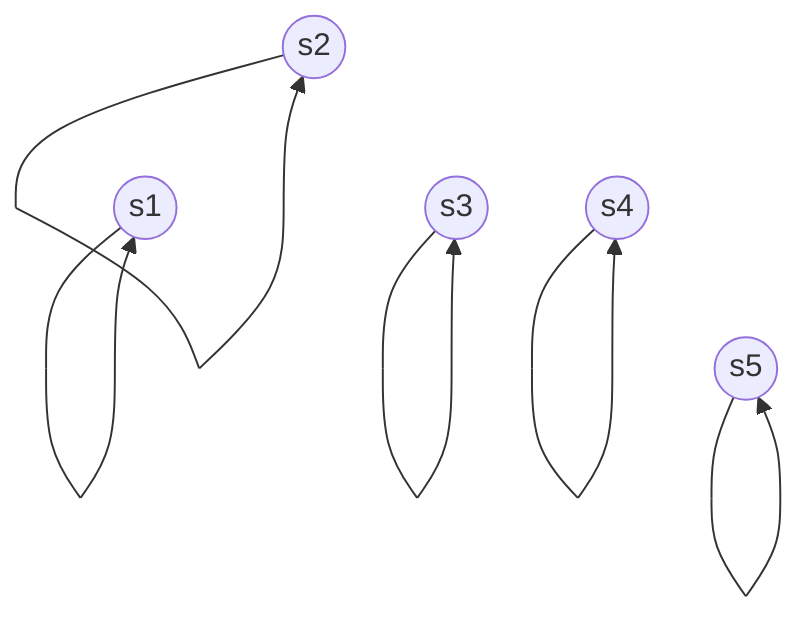

The **identity relation** $\mathrel{\mathsf{id}}$ is the easiest case of an [[equivalence relation]]. It relates every element of some [[set]] to itself. In [[matrix]] representation, it equals the [[identity matrix]] $I_{|X|}$ with dimension equal to the set's [[cardinality]].

It's [[graph]] representation is given below.

