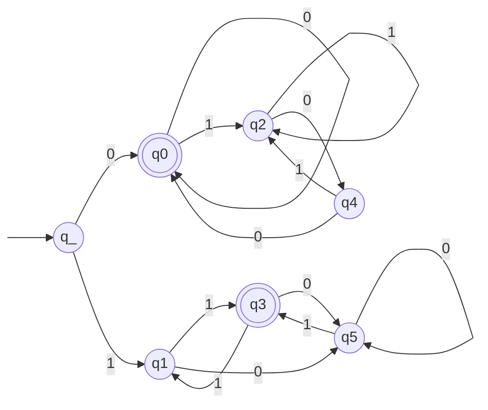

# VISIONEN

## opt-in model

how to get the correct addresses? -> trust sysadmin
uncompressed version online

## newsalert

maybe rolling release online?

## member feedback

last page feedback qr code

600mm x 420mm x 40mm

